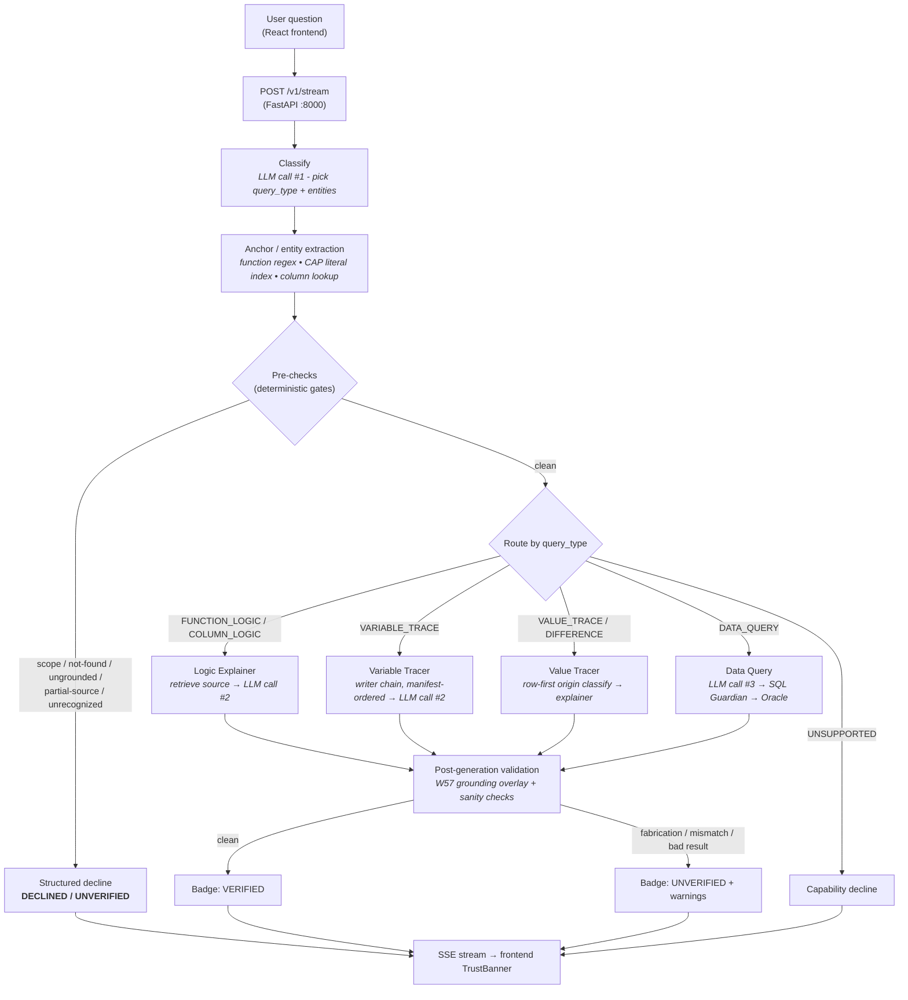

# RTIE - Regulatory Trace & Intelligence Engine

A read-only Oracle OFSAA regulatory-analysis tool. You ask a question in plain English - *how is this number calculated?* - and RTIE traces the answer through the bank's PL/SQL and database state, then returns an explanation where every claim cites its source, carries a trust badge, and is mechanically checked before you see it.

Built at Techlogix for analysts validating Basel III/IV capital calculations, where a confidently wrong answer is worse than no answer at all.

---

## The problem it solves

A regulatory analyst at a bank needs to defend a capital number to a regulator. The number was produced by a long chain of OFSAA PL/SQL functions writing into staging and fact tables, some of it loaded by external ETL rather than computed at all. Reading that pipeline by hand is slow and error-prone, and an LLM that *sounds* authoritative but invents a function name or a line range is actively dangerous in this setting.

RTIE is built so that it would rather say *"I don't know"* than guess. That is the entire point of the product, and everything below serves it.

## The trust contract

Every response RTIE returns carries one of three badges, and the badge is the verdict of a deterministic Python validation layer that inspects the LLM's output - not something the LLM asserts about itself.

**VERIFIED** - the cited functions were actually retrieved, citations resolve to real lines, the chain of cited functions is coherent, and no fabrication pattern fired. Trust the answer.

**UNVERIFIED** - the body may be largely right, but a validator caught something: a function named but not retrieved, a line range that isn't in the cited source, an unsupported paraphrase template, a calendar-gating claim the source doesn't support, or a data-query result that failed a sanity check. The `warnings` array names exactly what failed. Read the cited source before trusting.

**DECLINED** - RTIE refused. The named function isn't in the loaded graph, the identifier is ungrounded, the source body wasn't loaded, the term didn't resolve, or the query type is unsupported. The body explains why and often suggests a rephrasing.

Three principles hold this together: every claim cites a source; the badge, the warnings, and the body must agree; and RTIE is always read-only against Oracle. The validators are additive - each closes one specific failure class, and no single gate is load-bearing alone, but together they enforce the contract.

### What this looks like in practice

The same three queries RTIE is canary-tested against show the contract working. These are real responses captured from `/v1/stream`, not illustrations.

**A grounded data query → VERIFIED.** Ask *"What is the total `N_EOP_BAL` for `V_LV_CODE='ABL'` on 2025-12-31?"* RTIE classifies it as `DATA_QUERY`, generates SQL, validates it SELECT-only, executes read-only against Oracle, and formats the result deterministically:

```
badge:   VERIFIED
type:    data_query
summary: TOTAL_N_EOP_BAL = -24179237139.63.
sql:     SELECT SUM(N_EOP_BAL) AS TOTAL_N_EOP_BAL
         FROM STG_PRODUCT_PROCESSOR
         WHERE V_LV_CODE = :lv_code
           AND FIC_MIS_DATE = TO_DATE(:mis_date, 'YYYY-MM-DD')
```

The number is exact, and the SQL that produced it is stamped into the response so the analyst can re-run it themselves.

**A grounded logic trace → VERIFIED.** Ask *"How is `N_ANNUAL_GROSS_INCOME` calculated?"* and RTIE routes to `VARIABLE_TRACE`, resolves the column to its writer functions through the graph, and explains the calculation with line-numbered citations into the real source. No ungrounded-identifier warning fires.

**An ungrounded identifier → UNVERIFIED, honestly flagged.** Ask *"How is CAP973 calculated?"* CAP973 is a regulatory code that doesn't appear in any indexed function source. The generated prose may look plausible, but the W45 detector catches it and the badge is downgraded:

```
badge:    UNVERIFIED
validated: false
warnings: ["UNGROUNDED_IDENTIFIERS: CAP973 mentioned in query
            but not found in any loaded function source"]
```

The body is not suppressed, but the trust signal above it tells the analyst not to rely on it. This is the difference between RTIE and a chatbot.

---

## How a request flows

A question enters at `POST /v1/stream` and passes through classification, a set of pre-checks that can decline early, routing to a handler, generation, post-generation validation, and finally a streamed response.



Three things are worth calling out. First, there are exactly three LLM calls and all are bounded: classification picks a type from a fixed list, narrative generation explains pre-retrieved sources, and SQL generation translates against a schema catalog. **The LLM never decides what to look at next - the orchestrator does.** Second, the pre-checks run before any expensive work, so an ungrounded or out-of-scope question is declined cheaply. Third, the validation overlay runs only on `/v1/stream`; it is what turns raw generation into a badged, warned, trustworthy response.

### The stores behind it

Retrieval is served from **Redis Stack** (RediSearch is load-bearing - plain Redis will not work). Redis holds the parsed PL/SQL as MessagePack-compressed graphs, a column index, a business-identifier literal index, the manifest hierarchy, and a vector index of function descriptions for semantic fallback. Keys are namespaced by schema (`graph:OFSMDM:*`, `graph:OFSERM:*`).

**PostgreSQL** is the LangGraph checkpointer plus correlation tracking and conversation memory.

**Oracle OFSAA** is external and strictly read-only. Every query to it goes through `SqlGuardian` (SELECT-only, AST-validated, bind-parameters only) and `schema_tools` - there is no other path, by design. This read-only-against-Oracle guarantee is itself a trust feature: RTIE can be pointed at a live regulatory database without any risk of mutating it.

At startup the indexer walks the PL/SQL corpus, parses each function into typed nodes, writes the graph, generates and embeds descriptions, and builds the column and business-identifier indexes. A 1,500-line function compresses to a small structured payload, so at query time only the relevant subgraph - a few KB - is sent to the LLM rather than the raw source.

### Schema coverage

OFSAA exposes two schemas, and they are at different stages.

**OFSMDM** (staging / master-data layer) is fully indexed and production-ready: graph, column index, vector index, and business-identifier literals are all populated. Most current canaries run against it.

**OFSERM** (Basel runtime / risk-computation layer) is parsed and stored, and schema-aware retrieval, source fetch, and routing have landed (W35 phases 0-4). A deterministic computation router (W88) maps a fixed registry of named Basel computations - BIA operational-risk capital, CET1 (CAP960), Tier 1 (CAP214), CAR (CAP192), aggregate Credit RWA (CAP169), aggregate Market RWA (CAP090) - to their canonical OFSERM fact tables (`FCT_OPS_RISK_DATA`, `FCT_STANDARD_ACCT_HEAD`). What remains is general business-identifier (CAP-code) indexing and routing - W35 phases 5-8 - so arbitrary CAP-code questions against OFSERM are not yet fully served. See `docs/RTIE_Weakness_Log.md` and the `docs/w35_*.md` series for the current state.

---

## Query types

The orchestrator classifies every question into one of seven types and routes to the matching handler.

| Query type | Example | Handler |
|---|---|---|
| `FUNCTION_LOGIC` | "Explain `FN_LOAD_OPS_RISK_DATA`" | Logic Explainer |
| `COLUMN_LOGIC` | "What does `N_EOP_BAL` do?" | Logic Explainer |
| `VARIABLE_TRACE` | "How is `N_ANNUAL_GROSS_INCOME` calculated?" | Variable Tracer |
| `VALUE_TRACE` | "Why is `N_EOP_BAL` -10 for account X?" | Value Tracer (Phase 2) |
| `DIFFERENCE_EXPLANATION` | "Bank says 52M, we show 50M for account X" | Value Tracer (Phase 2) |
| `DATA_QUERY` | "Total `N_EOP_BAL` for `V_LV_CODE='ABL'`" | Data Query agent |
| `UNSUPPORTED` | reconciliation, forecasting | Capability decline |

The logic and trace handlers (Phase 1) work over the parsed graph. The Value Tracer (Phase 2) is **row-first**: it fetches the actual row from Oracle and reads its `V_DATA_ORIGIN` column to decide whether the value was computed by PL/SQL or loaded by external ETL - because a graph-first trace silently breaks on rows that never flowed through PL/SQL at all. The Data Query agent (Option A) generates SQL with three safeguards against large-dataset incidents: a `COUNT(*)` pre-check that rejects above 10,000 rows and asks for confirmation between 100 and 10,000, an aggregation preference in the prompt, and a mandatory `FETCH FIRST 100 ROWS ONLY` injection on row-listing queries. After execution, sanity checks flag empty results on populated tables (W33) or all-NULL metric columns (W86) by flipping the badge to UNVERIFIED.

When classification is ambiguous the orchestrator defaults to `VALUE_TRACE`; routing to `DATA_QUERY` requires an explicit aggregation keyword (`total`, `sum`, `count`, `how many`, `which accounts`) and the absence of a specific account number. Mis-routing aggregations was the original silent-failure bug, which is why this rule is strict.

---

## Streaming response shape

Every response streams as Server-Sent Events: `stage` events for progress, a `meta` event carrying the function list / schema scope / SQL, `token` events for incremental markdown, and a final `done` event whose payload carries `badge`, `validated`, `warnings`, `explanation`, `functions_analyzed`, `source_citations`, `sql` (for data queries), and a `diagnostic` block. The React frontend's `TrustBanner` component renders the badge and warnings *above* the response body, so the trust signal is visible before the analyst reads a word of prose.

The warning prefixes are meaningful on their own:

| Warning | Effect | Meaning |
|---|---|---|
| `GROUNDING-HIGH:` | forces UNVERIFIED | content-trust failure - fabricated function name, unsupported template phrase, or calendar-claim mismatch |
| `GROUNDING-LOW:` | advisory (stays VERIFIED) | citation hygiene - repeated or excessive citations, padding |
| `UNGROUNDED_IDENTIFIERS` | forces UNVERIFIED | an identifier in the query appears in no indexed source |
| `NAMED_FUNCTION_NOT_RETRIEVED` | forces UNVERIFIED | a named function's source wasn't retrieved for this query |
| `PARTIAL_SOURCE` | forces UNVERIFIED | function metadata is indexed but the source body isn't loaded |
| `UNRECOGNIZED_TERM` | forces UNVERIFIED | no entity-extraction path resolved the reference |
| `suspicious_zero_result` / `suspicious_metric_all_null` | forces UNVERIFIED | data-query sanity check failed (W33 / W86) |

### Two endpoints - use the right one

**`/v1/stream` is canonical.** It runs the W57 grounding overlay and is the only endpoint whose `done` payload carries `badge` / `validated` / `warnings`. The frontend, the canary harness, and any benchmark driver must read this one.

**`/v1/query` returns raw LangGraph state** and skips the grounding overlay entirely - no badge, no warnings. It is for debugging only. The body prose can look like a valid explanation even when the route is wrong, so never probe `/v1/query` for trust signals.

---

## Installation

RTIE runs as a bare-metal Python backend plus a Vite frontend, with Redis and
PostgreSQL provided as local Docker containers. There is no Docker image for the
app itself — you run it directly from source. All commands assume `cwd = RTIE/`.

**Prerequisites**
- Python 3.11+
- Node.js 18+ and npm (for the frontend)
- Docker Desktop (for the Redis + PostgreSQL containers)
- An Oracle OFSAA instance with OFSMDM (and, for regulatory queries, OFSERM)
  reachable with read-only credentials
- An OpenAI API key (required for embeddings even if you route generation to Claude)

### 1. Clone the repository

```bash
git clone https://github.com/ToheedAsghar/R-TIE.git
cd R-TIE/RTIE
```

### 2. Create and activate a virtual environment

```bash
python -m venv .venv
# Windows (PowerShell):
.venv\Scripts\Activate.ps1
# macOS / Linux:
source .venv/bin/activate
```

### 3. Install dependencies

```bash
pip install -r requirements.txt
# or, if you use Poetry:
poetry install && poetry shell
```

### 4. Configure environment variables

```bash
cp .env.example .env.dev
```

Edit `.env.dev` and fill in at least:
- `ORACLE_HOST` / `ORACLE_PORT` / `ORACLE_SID` / `ORACLE_USER` / `ORACLE_PASSWORD`
- `OPENAI_API_KEY`
- `POSTGRES_PASSWORD`

Leave `REDIS_HOST` / `POSTGRES_HOST` as `localhost` for this bare-metal workflow.
See the [Key environment variables](#key-environment-variables) table below for the full list.

### 5. Start the data services (Redis + PostgreSQL)

```bash
docker compose up -d redis postgres
```

This brings up two containers — `rtie-redis` (Redis Stack, with RediSearch) on
`:6379` and `rtie-postgres` on `:5432`. The app backend/frontend are **not**
started by Docker; you run those directly in the next steps.

### 6. Index the corpus

```bash
python cli.py index --force
```

This parses the PL/SQL corpus, generates and embeds function descriptions, and
builds the column and business-identifier indexes in Redis. Run it once on first
setup and again after adding modules.

### 7. Run the backend

```bash
python run.py
```

The backend serves on <http://localhost:8000> (health check at
<http://localhost:8000/health>).

> **Start the backend with `python run.py`, never `uvicorn src.main:app` directly.**
> `run.py` sets `WindowsSelectorEventLoopPolicy` before importing uvicorn; the
> psycopg async driver requires the selector loop, and Windows' default proactor
> loop crashes it. The launcher is harmless on Linux.

### 8. Run the frontend

In a second terminal:

```bash
cd frontend
npm install
npm run dev
```

The chat UI is then at <http://localhost:5173>.

A clean-machine Windows walkthrough lives at [docs/WINDOWS_SETUP.md](docs/WINDOWS_SETUP.md).

---

## Key environment variables

Loaded from `.env.{ENVIRONMENT}` (`dev` by default → `.env.dev`); see `.env.example` for the full template.

| Variable | Purpose |
|---|---|
| `OPENAI_API_KEY` | required - classification, embeddings, indexing, generation |
| `OPENAI_MODEL` | default OpenAI model (`gpt-4o-mini`) |
| `DEFAULT_LLM_PROVIDER` | `openai` or `anthropic` |
| `ANTHROPIC_API_KEY` / `ANTHROPIC_MODEL` | optional - route generation to Claude |
| `EMBEDDING_MODEL` | OpenAI embedding model (`text-embedding-3-small`) |
| `ORACLE_HOST` / `ORACLE_PORT` / `ORACLE_SID` / `ORACLE_USER` / `ORACLE_PASSWORD` | Oracle (read-only) |
| `REDIS_HOST` / `REDIS_PORT` | Redis Stack |
| `POSTGRES_HOST` / `POSTGRES_PORT` / `POSTGRES_DB` / `POSTGRES_USER` / `POSTGRES_PASSWORD` | LangGraph checkpointer |
| `LANGSMITH_*` | optional tracing |

---

## Verifying a deployment

After the backend is up, the three-query canary set exercises the three core paths and confirms the trust contract is intact:

| Query | Expected |
|---|---|
| `What is the total N_EOP_BAL for V_LV_CODE='ABL' on 2025-12-31?` | **VERIFIED** · `DATA_QUERY` · `SUM = -24,179,237,139.63` (exact) |
| `How is N_ANNUAL_GROSS_INCOME calculated?` | **VERIFIED** · `VARIABLE_TRACE` · grounded, no ungrounded warning |
| `How does FN_LOAD_OPS_RISK_DATA work?` | **UNVERIFIED** · `COLUMN_LOGIC` · `GROUNDING-HIGH:` warning catches the line-198-369 padding and the unsupported pass-through template phrase |

The first is the deterministic data path - the SUM is exact, not approximate. The third is a deliberate trust-contract test: the body looks plausible but contains a fabrication that the W57 grounding overlay catches and downgrades. If any of these diverges, the index or the setup is wrong.

The formal suite is `tests/canary/canaries.yaml` (18 queries across 3 tiers). Run it with the backend already running on `:8000`:

```bash
python tests/canary/run_canaries.py --tier 1   # or: make canary-tier1
```

Common operations:

```bash
python cli.py status                  # indexed function counts per schema
python cli.py ask "How is N_EOP_BAL calculated?"
python cli.py index --force           # re-index after adding modules
python -m pytest tests/unit/ -v       # unit suite
docker exec -it rtie-redis redis-cli DBSIZE   # Redis key count
```

### Adding a module

Drop `.sql` files (one function or procedure each, filename matching the function name) under `db/modules/<MODULE>/functions/`, re-index with `python cli.py index --force`, and restart. The graph re-parses, the origins catalog auto-rebuilds, and new `V_DATA_ORIGIN` values and GL codes are picked up with no code changes.

---

## Project status

The architecture is stable; correctness work is ongoing and tracked in `docs/RTIE_Weakness_Log.md` under the W-ticket convention used throughout the codebase, branches, and PR titles.

OFSMDM is fully indexed and production-ready. OFSERM is parsed and stored with schema-aware retrieval and routing landed and a deterministic router for named Basel computations; general CAP-code indexing and routing remain (W35). RTIE deliberately excludes proactive batch detection, forecasting, write operations, and speculative features - that boundary is a design decision, not a backlog.

For deeper detail: [CLAUDE.md](../CLAUDE.md) for conventions and where-to-look-first, [docs/ARCHITECTURE_OVERVIEW.md](docs/ARCHITECTURE_OVERVIEW.md) for fuller diagrams, [docs/RTIE_Weakness_Log.md](docs/RTIE_Weakness_Log.md) for known weaknesses and the priority queue.

---

*RTIE is built at Techlogix for bank-side OFSAA regulatory analysis. It prioritizes verifiability over flexibility; the trust contract is non-negotiable.*
