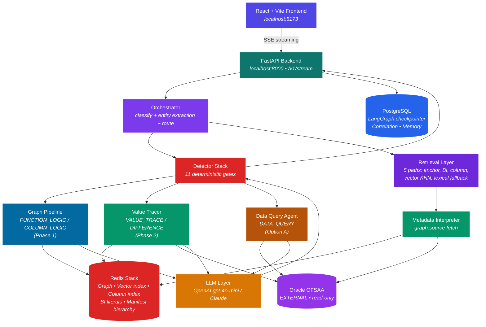
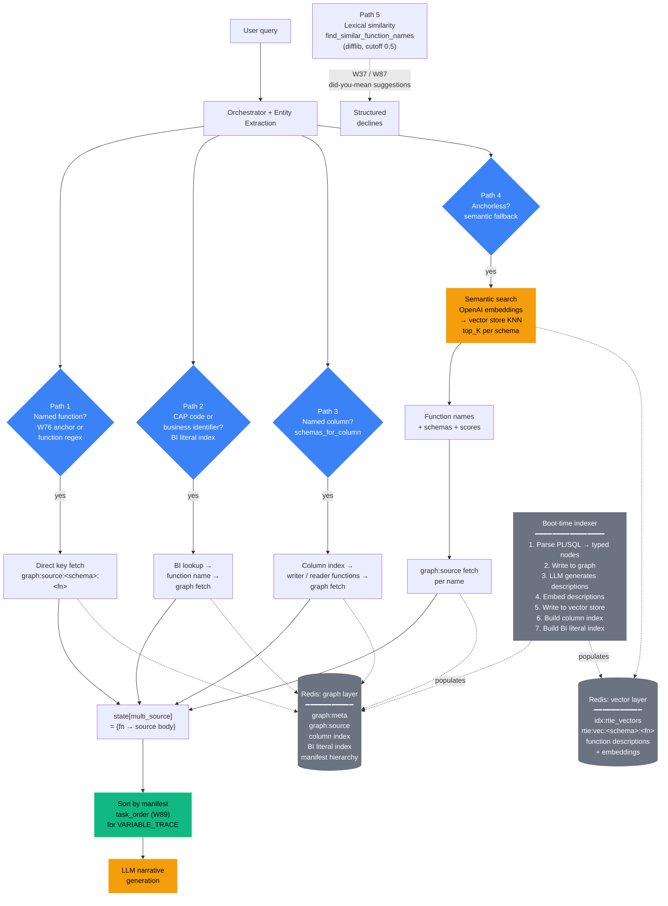
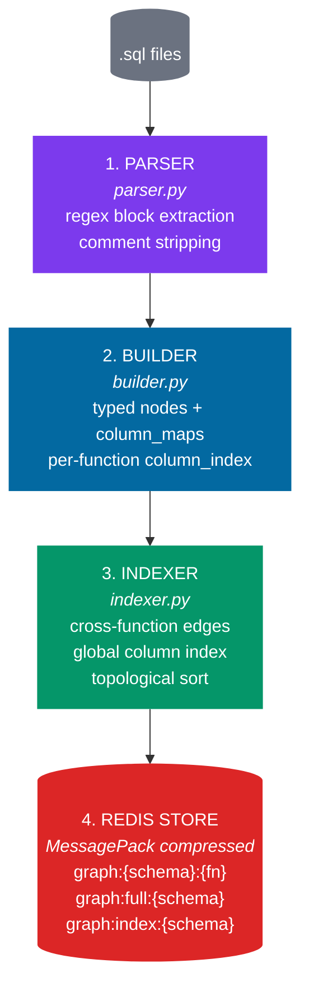
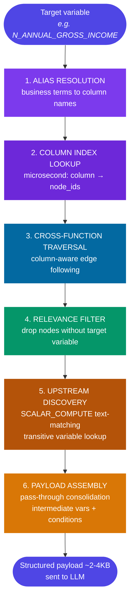
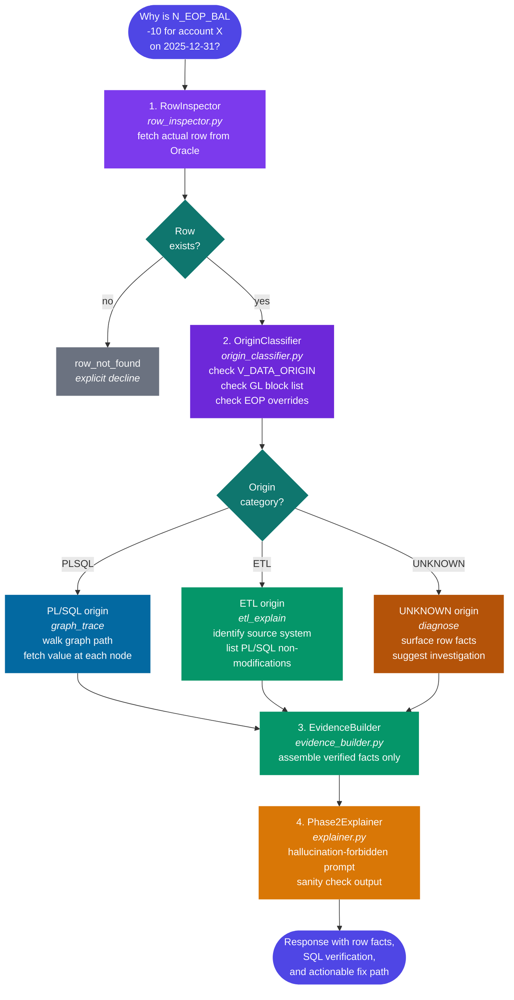
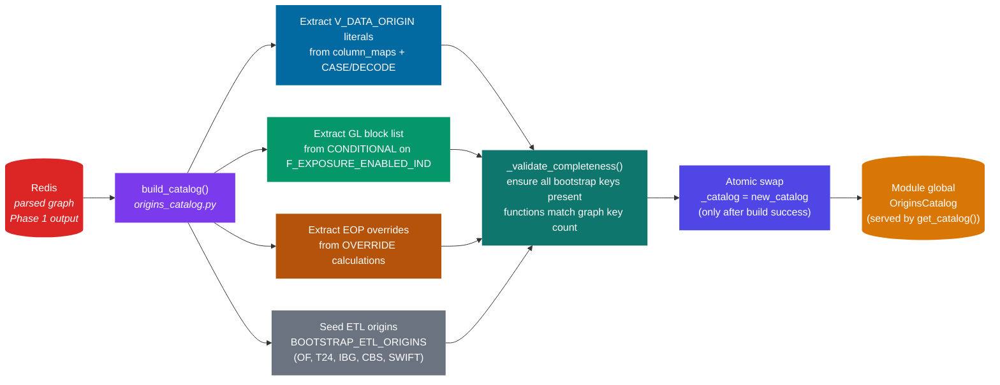
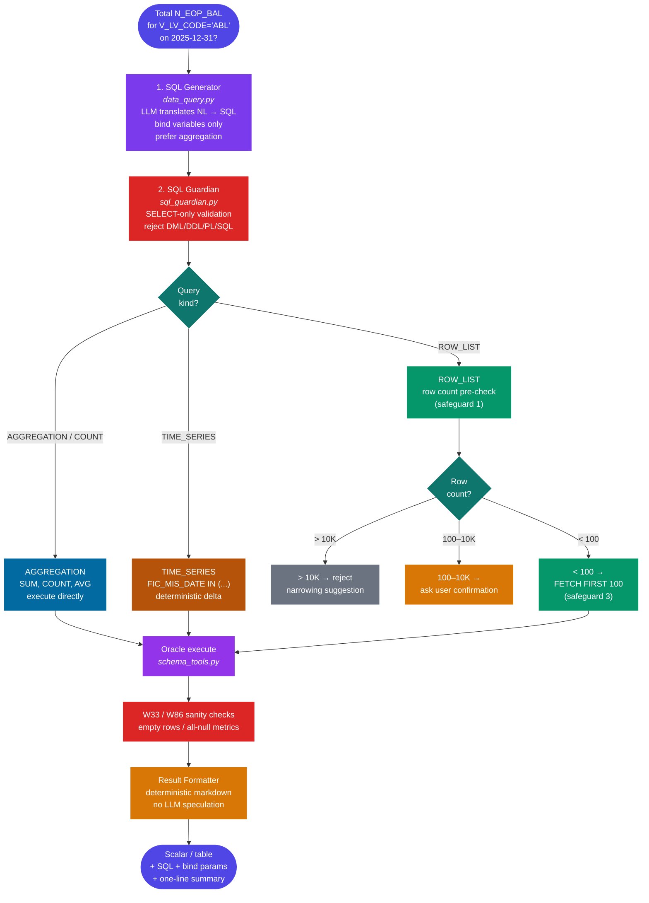

# RTIE — Regulatory Trace & Intelligence Engine

A read-only Oracle OFSAA regulatory analysis tool. Trace Basel III/IV capital calculations through PL/SQL, explain function logic with line citations, classify row origins (PL/SQL versus ETL), execute validated SELECT-only SQL — every answer grounded in parsed code or fetched data, every claim source-cited, every uncertain response explicitly declined.

Built for Techlogix engineers working on bank-side regulatory capital computations.

---

## Why RTIE exists

Regulatory analysts at banks need to answer a specific kind of question: *"How is this number calculated?"* — and they need to defend the answer to a regulator. A confidently wrong answer is worse than no answer. The architecture prioritizes refusal over guessing.

RTIE turns natural-language questions about OFSAA regulatory calculations into verified, source-cited explanations. Three guarantees define what shipping means:

1. **Every claim cites source.** A response that asserts "Function X computes Y on line N" is mechanically verified against the parsed source before the user sees it.
2. **Read-only against Oracle, always.** The application layer and the Oracle service account both refuse writes.
3. **No silent wrong answers.** The badge on every response (`VERIFIED` / `UNVERIFIED` / `DECLINED`) is what a deterministic validation layer concluded after inspecting the LLM's output — not what the LLM claimed about itself.

---

## Features

### Core capabilities

- **Function logic explanation** — explain what a PL/SQL function does, with line-numbered citations into the actual source code.
- **Variable / column tracing** — trace how a column flows through the calculation pipeline, walking writer functions in execution order as declared by the OFSAA batch manifest.
- **Row-level value lineage** — given a specific row in a staging fact, classify whether its value was computed by PL/SQL or loaded from an external ETL system, and explain why.
- **Data queries via validated SQL** — translate natural-language questions into SELECT statements, validate them against a guardian (SELECT-only, bind variables, no privileged tables), execute read-only against Oracle, return both the result and the SQL.
- **Business-identifier routing** — recognize regulatory codes (CAP series, standard account heads) and route to the functions that reference them via a literal index.
- **Schema-aware retrieval** — supports OFSMDM (staging/master data) and OFSERM (Basel runtime tables) as first-class schemas; cross-schema chains are handled with explicit schema attribution.

### Trust enforcement (the W-ticket detector stack)

RTIE's defining property is that the badge means something. A series of deterministic Python gates inspects LLM output and either passes it (`VERIFIED`), flags it (`UNVERIFIED` with structured warnings), or declines it (`DECLINED`). None of the detectors ask the LLM to validate its own work.

| Gate | Stage | What it catches |
|---|---|---|
| Scope mismatch | pre-search | query asks about something outside RTIE's parsed scope |
| W37 function precheck | pre-search | user named a function not in the loaded graph; DECLINED with "did you mean?" |
| W45 ungrounded identifier | pre-search | user named a CAP code / business identifier with no literal-index match |
| W49 partial-source function | pre-search | function metadata indexed but source body unavailable |
| W87 unrecognized term | pre-search | no entity resolved through any extraction path; structured clarification |
| W57 grounding overlay | post-generation | citations exist and resolve; cited function present in retrieved sources; no padding |
| W83a / W83B / W83C | post-generation | LLM fabricated month/quarter/year-end gating not supported by source |
| W85 anchor mismatch | post-generation | LLM anchored on a different function than the one the user asked about |
| W78a fabricated function name | post-generation | LLM cited a function name not in retrieved sources |
| W33 / W86 sanity checks | post-execution | DATA_QUERY returned zero rows on a populated table, or metric columns were entirely NULL |
| W89 chain ordering | retrieval | VARIABLE_TRACE chain reordered by manifest `task_order` before narrative |

Detectors are additive. Each ticket closes a specific failure class. The detector stack composes — no single gate is load-bearing alone, but together they enforce the trust contract.

### Streaming response format

Every response streams as Server-Sent Events:

| Event | Purpose |
|---|---|
| `stage` | progress indicator (classify / route / retrieve / generate / validate) |
| `meta` | function list, schema scope, SQL (for DATA_QUERY), bind parameters |
| `token` | incremental markdown content |
| `done` | final payload: `badge`, `validated`, `warnings`, `explanation`, `functions_analyzed`, `source_citations`, `meta`, `diagnostic` |

The frontend's `ValidationHeader` (W46) renders the badge and warnings above the response body so the trust signal is visible before the user reads the prose.

---

## Quick start — Docker (recommended)

Assuming Docker Desktop is installed and an Oracle FSAPPS instance is reachable.

```bash
git clone https://github.com/ToheedAsghar/R-TIE.git
cd R-TIE/RTIE
cp .env.example .env.dev
# Edit .env.dev — fill ORACLE_HOST/PORT/SID/USER/PASSWORD, OPENAI_API_KEY, POSTGRES_PASSWORD.

# One-time: log in to GitHub Container Registry to pull the pre-warmed Redis image.
# Create a PAT (classic) with `read:packages` at https://github.com/settings/tokens
echo <PAT> | docker login ghcr.io -u <github-username> --password-stdin

docker compose up -d --build
```

The Redis service pulls a **pre-warmed image** (`ghcr.io/toheedasghar/r-tie-redis-prewarmed`) that already contains the indexed corpus — first boot completes in **seconds**, not the 5–30 minutes a cold indexing would take. See [Pre-warmed Redis image](#pre-warmed-redis-image-maintainer--teammate-workflow) for the maintainer republish workflow and opt-out path.

Watch the startup:

```bash
docker compose logs -f rtie-app-backend
```

**Access points after startup:**

| Service | URL |
|---|---|
| Frontend (chat UI) | <http://localhost:5173> |
| Backend (direct API) | <http://localhost:8000/health> |
| RedisInsight (dev only) | <http://localhost:8001> |

**Four containers:**

| Container | Role |
|---|---|
| `rtie-app-backend` | FastAPI + LangGraph orchestrator + corpus baked into the image |
| `rtie-app-frontend` | nginx-served Vite build of the React UI |
| `rtie-redis` | Redis Stack with RediSearch (vector store + graph store + indexes) |
| `rtie-postgres` | LangGraph checkpointer + correlation tracking + conversation memory |

The compose file splits the stack into two logical groups under the same `rtie` project:

- **Data services** — service names `redis` / `postgres`; container names `rtie-redis` / `rtie-postgres`; volumes `rtie_redis_data` / `rtie_postgres_data` (persistent).
- **App services** — service names `rtie-app-backend` / `rtie-app-frontend`; container names match.

That distinction matters for the CLI: `docker compose <verb>` takes **service** names, `docker exec <name>` and `docker ps` show **container** names. The two are deliberately different so you can rebuild / restart the app without touching the data side:

```bash
docker compose up -d redis postgres                       # data-only (hybrid dev with `python run.py`)
docker compose up -d rtie-app-backend rtie-app-frontend   # app-only, against already-running data
docker compose up -d                                      # everything
docker compose restart rtie-app-backend                   # bounce only the backend
docker compose down rtie-app-backend rtie-app-frontend    # tear down app, leave data running
```

Oracle is external — the backend dials it via the DSN you put in `.env.dev`.

### What to expect on first boot

By default the compose file pulls a **pre-warmed Redis image** (`ghcr.io/toheedasghar/r-tie-redis-prewarmed`) that already contains the indexed corpus — graph, vector index, BI literals, column index, the lot. First boot for a teammate looks like this:

- Docker pulls `r-tie-redis-prewarmed` (5–10 MB compressed) and `r-tie-rtie-app-backend` / `r-tie-rtie-app-frontend`.
- Compose creates a fresh `rtie_redis_data` volume; Docker copies the image's baked-in `/data/dump.rdb` into it on first mount.
- Redis starts and loads the corpus from RDB in <1 second.
- Backend lifespan runs the loader/indexer, sees every function already cached, skips it. `/health` returns 200 in **seconds**.

If you opt out of the prewarmed image (`RTIE_REDIS_IMAGE=redis/redis-stack:latest`) or wipe the volume (`docker compose down -v`), you fall back to **~5–30 minutes of cold indexing**: the lifespan walks `db/modules/` (the Techlogix corpus baked into the backend image), populates the Redis graph, generates LLM descriptions, builds the vector index. Watch the log for lines like `Module ABL_CAR_CSTM_V4: loaded N, skipped 0, failed 0` and `Auto-index OFSMDM: N indexed`. After indexing, `/health` returns 200 and the frontend becomes usable.

### Pre-warmed Redis image (maintainer + teammate workflow)

The prewarmed image is hosted privately on GitHub Container Registry. Image: `ghcr.io/toheedasghar/r-tie-redis-prewarmed`.

**Teammate one-time setup** — authenticate Docker to GHCR so the pull works:

```bash
# Create a GitHub Personal Access Token (classic) with `read:packages` scope:
#   https://github.com/settings/tokens
# Then log in once per machine:
echo <PAT> | docker login ghcr.io -u <github-username> --password-stdin
```

After that, `docker compose up -d` pulls the image automatically. No manual indexing required.

**Maintainer republish workflow** — when you add a new module or otherwise re-index locally, refresh the published image so teammates pick up the new corpus:

```powershell
# From the RTIE folder (rtie-redis must be running with the desired state)
.\scripts\publish_redis_image.ps1                # build + push :latest + :YYYYMMDD-HHmm
.\scripts\publish_redis_image.ps1 -NoPush        # build only, no push (for local validation)
.\scripts\publish_redis_image.ps1 -Tag v2        # also tag :v2
```

The script triggers `BGSAVE`, copies the resulting `dump.rdb` into `deploy/redis/`, builds the image, and pushes to GHCR. The `dump.rdb` is gitignored — only the image itself ships.

**Opting out** — to bring up vanilla Redis Stack (e.g. to validate the cold-start indexer path):

```powershell
$env:RTIE_REDIS_IMAGE = "redis/redis-stack:latest"
docker compose down -v       # wipe the prewarmed volume
docker compose up -d         # cold indexing path
```

**How the warming actually reaches the running Redis.** Compose mounts the named volume `rtie_redis_data` at `/data`. On a **fresh** volume, Docker copies the image's baked-in `/data/dump.rdb` into it before redis-server starts — so the corpus is there from boot. On a **warm** volume (e.g. your laptop after re-indexing), the existing volume contents win and the baked-in RDB is shadowed; that's why publishing a new image doesn't accidentally overwrite your in-progress local index.

### Common Docker operations

```bash
docker compose down              # stop, preserve volumes (fast restart next time)
docker compose down -v           # stop and wipe volumes (re-runs the indexer)
docker compose up -d --build     # rebuild after Dockerfile / source changes
docker compose logs -f rtie-app-backend
docker compose exec rtie-app-backend bash
docker compose restart rtie-app-backend
```

### Docker-specific notes

- **Oracle host from inside containers:** if Oracle runs on the same laptop, set `ORACLE_HOST=host.docker.internal` (Windows / macOS) — not `localhost`. On Linux, use the host bridge IP.
- **Embeddings always go through OpenAI**, regardless of `DEFAULT_LLM_PROVIDER`. An `OPENAI_API_KEY` is mandatory even if you're routing generation to Claude.
- **Redis must stay Redis Stack** — RediSearch is load-bearing. Plain `redis:alpine` will fail `FT.CREATE` at startup.
- **`REDIS_HOST` and `POSTGRES_HOST` in `.env.dev` are ignored by compose** — the compose file overrides them to `rtie-redis` / `rtie-postgres`. The same `.env.dev` works for bare-metal `python run.py` (where `localhost` is the right value).

### Validating the containerized stack

A full cold-start → canary → warm-restart validation that proves the stack works end-to-end:

```bash
docker compose down -v
docker compose up -d
docker compose logs -f rtie-app-backend   # wait until /health returns 200
```

Then in the UI ask:

> What is the total `N_EOP_BAL` for `V_LV_CODE='ABL'` on 2025-12-31?

Expect a **VERIFIED** badge with `SUM(N_EOP_BAL) = -24,179,237,139.63`. If the response matches, the stack is working end-to-end. Anything else means investigate before declaring deployable.

---

## Quick start — Manual setup

Two variants below for Linux/macOS and Windows. Use this when you want to iterate on backend code without rebuilding container images.

### Prerequisites

| Tool | Version | Notes |
|---|---|---|
| Python | 3.11+ (`pyproject.toml` declares `^3.11`) | 3.12 / 3.13 also work |
| Python deps | Poetry **or** pip | `poetry install` (managed venv) **or** `pip install -r requirements.txt` (simpler). Both resolve to the same dependency set — `requirements.txt` mirrors `pyproject.toml [tool.poetry.dependencies]` and adds the directly-imported transitives (`langchain-core`, `anthropic`, `openai`, `httpx`, `starlette`, `psycopg-pool`). |
| Docker Desktop (Windows) or Docker Engine (Linux) | recent | for Redis Stack + PostgreSQL |
| Node.js + npm | LTS (20.x / 22.x) | for the React/Vite frontend |
| Oracle access | OFSAA FSAPPS with OFSMDM + OFSERM | read-only credentials; provisioning is out of scope |
| OpenAI API key | — | required: classification, embeddings, indexing, generation |
| Anthropic API key | — | optional: model selector can route generation to Claude |
| LangSmith API key | — | optional: tracing / observability |

A standalone Windows walkthrough (Git, WSL 2, Docker Desktop, every download link) lives at [docs/WINDOWS_SETUP.md](docs/WINDOWS_SETUP.md).

### Linux / macOS

All commands run from inside `RTIE/`.

```bash
# 1. Install Python dependencies — pick ONE
pip install -r requirements.txt    # simplest, no venv tooling required
# OR, for a managed venv:
poetry install && poetry shell     # prefix later commands with `poetry run` if not in shell

# 2. Create .env.dev from template, fill in secrets
cp .env.example .env.dev
$EDITOR .env.dev                   # set ORACLE_*, OPENAI_API_KEY, etc.

# 3. Start Redis Stack + PostgreSQL only (service names are `redis` / `postgres`;
#    container names are `rtie-redis` / `rtie-postgres`)
docker compose up -d redis postgres
docker ps                          # expect rtie-redis and rtie-postgres, both Up

# 4. Verify Redis
docker exec -it rtie-redis redis-cli PING        # → PONG

# 5. Verify Postgres
docker exec -it rtie-postgres pg_isready -U postgres

# 6. (One-time, if db/modules/ is not already populated) place PL/SQL sources
#    under db/modules/<MODULE>/functions/*.sql

# 7. One-time index — parses sources, generates descriptions, builds vectors
python cli.py index --force

# 8. Start the backend (do NOT run `uvicorn src.main:app` directly — see below)
python run.py                      # listens on http://localhost:8000

# 9. Start the frontend in a second terminal
cd frontend
npm install
npm run dev                        # serves http://localhost:5173
```

Open <http://localhost:5173>. The chat UI streams responses from `/v1/stream`.

**Why `python run.py` and not `uvicorn`.** `run.py` sets `WindowsSelectorEventLoopPolicy` on Windows before importing uvicorn. The psycopg async driver requires `SelectorEventLoop`; Windows' default `ProactorEventLoop` is incompatible. The launcher is a no-op on Linux but harmless to use everywhere.

### Windows (PowerShell)

```powershell
# All commands run inside the RTIE folder.

# 1. Install Python dependencies — pick ONE
pip install -r requirements.txt    # simplest
# OR, for a managed venv:
pip install poetry
poetry install
poetry shell

# 2. Create and edit .env.dev
Copy-Item .env.example .env.dev
notepad .env.dev

# 3. Start infrastructure (Docker Desktop must be running first)
#    Service names are `redis` / `postgres`; container names are `rtie-redis` / `rtie-postgres`.
docker compose up -d redis postgres

# 4. Verify Redis + Postgres
docker exec -it rtie-redis redis-cli PING
docker exec -it rtie-postgres pg_isready -U postgres

# 5. Index sources
python cli.py index --force

# 6. Start backend
python run.py

# 7. In a second PowerShell window — start frontend
cd frontend
npm install
npm run dev
```

**Restarting the backend on Windows — never blanket-kill Python.** `taskkill /F /IM python.exe` kills every Python process on the machine, including agent workers in other terminals. Find the specific PID:

```powershell
netstat -ano | findstr :8000      # find PID owning port 8000
taskkill /PID <pid> /F             # kill only that PID
python run.py                      # restart
```

---

## Architecture

### High-level system



### Full request pipeline — every stage

This diagram shows every stage a question passes through, including every pre-search gate and every post-generation validation overlay. No stages skipped.

```mermaid
flowchart TD
    User["User Question<br/>(React frontend)"] --> Entry["POST /v1/stream<br/>(FastAPI)"]
    Entry --> Classify["Stage 1: Classify<br/><b>LLM CALL #1</b><br/>bounded: query_type + entities"]
    Classify --> AnchorEx["Stage 2: Anchor extraction<br/>W76 prefix detector,<br/>BI routing (CAP literal index),<br/>function-name regex"]

    AnchorEx --> PreChecks["Stage 3: Pre-checks<br/>(6 deterministic gates, sequential)"]
    PreChecks --> G1{"Scope<br/>mismatch?"}
    G1 -->|"yes"| Decline
    G1 -->|"no"| G2{"BI scope<br/>mismatch?"}
    G2 -->|"yes"| Decline
    G2 -->|"no"| G3{"W37<br/>function<br/>not found?"}
    G3 -->|"yes"| Decline
    G3 -->|"no"| G4{"W45<br/>ungrounded<br/>identifier?"}
    G4 -->|"yes"| Decline
    G4 -->|"no"| G5{"W49<br/>partial-source<br/>function?"}
    G5 -->|"yes"| Decline
    G5 -->|"no"| G6{"W87<br/>no entity<br/>resolved?"}
    G6 -->|"yes"| Decline
    G6 -->|"no"| Route{"Stage 4: Route<br/>by query_type"}

    Decline["Structured decline<br/><b>DECLINED or UNVERIFIED</b><br/>deterministic template"]

    Route -->|"FUNCTION_LOGIC<br/>COLUMN_LOGIC"| F4a["Stage 5a — Logic Explainer<br/>retrieve source from Redis<br/>build hierarchy header (W39)<br/><b>LLM CALL #2</b>: narrative streaming"]

    Route -->|"VARIABLE_TRACE"| F4b["Stage 5b — Variable Tracer<br/>retrieve writer chain<br/>sort by manifest task_order (W89)<br/>extract relevant lines<br/><b>LLM CALL #2</b>: narrative streaming"]

    Route -->|"VALUE_TRACE<br/>DIFFERENCE_EXPLANATION"| F4d["Stage 5d — Value Tracer<br/>row inspect → origin classify<br/>graph/ETL/unknown path<br/>evidence build → explainer LLM"]

    Route -->|"DATA_QUERY"| F4c["Stage 5c — Data Query<br/><b>LLM CALL #3</b>: SQL generation<br/>SQL Guardian validate<br/>classify shape (aggregate/row/series)<br/>execute on Oracle<br/>format deterministically"]

    Route -->|"UNSUPPORTED"| Unsupp["Capability decline<br/>explicit DECLINED"]

    F4a --> Overlays["Stage 6: Validation overlays<br/>(post-generation, deterministic)"]
    F4b --> Overlays
    F4d --> Overlays
    F4c --> Sanity["DATA_QUERY sanity checks<br/>W33: suspicious zero result<br/>W86: all-null metric columns"]
    Sanity --> Overlays

    Overlays --> O1{"W57<br/>citations<br/>valid?"}
    Overlays --> O2{"W83a/B/C<br/>calendar<br/>fabrication?"}
    Overlays --> O3{"W85<br/>anchor<br/>mismatch?"}
    Overlays --> O4{"W78a<br/>fabricated<br/>function?"}
    O1 -->|"any check fails"| Unverified
    O2 -->|"fires"| Unverified
    O3 -->|"fires"| Unverified
    O4 -->|"fires"| Unverified
    O1 -->|"clean"| Verified
    O2 -->|"silent"| Verified
    O3 -->|"silent"| Verified
    O4 -->|"silent"| Verified

    Verified["Badge: <b>VERIFIED</b>"]
    Unverified["Badge: <b>UNVERIFIED</b><br/>+ warnings array"]

    Verified --> Stream["Stage 7: SSE stream to user<br/>tokens + final done event<br/>(badge, warnings, citations,<br/>functions_analyzed, diagnostic)"]
    Unverified --> Stream
    Decline --> Stream
    Unsupp --> Stream

    Stream --> Frontend["React frontend<br/>ValidationHeader (W46)<br/>renders badge + warnings"]
    Frontend --> Display["User reads response"]

    style Classify fill:#f59e0b,color:#000,stroke:none
    style F4a fill:#f59e0b,color:#000,stroke:none
    style F4b fill:#f59e0b,color:#000,stroke:none
    style F4c fill:#f59e0b,color:#000,stroke:none
    style F4d fill:#f59e0b,color:#000,stroke:none
    style PreChecks fill:#3b82f6,color:#fff,stroke:none
    style G1 fill:#3b82f6,color:#fff,stroke:none
    style G2 fill:#3b82f6,color:#fff,stroke:none
    style G3 fill:#3b82f6,color:#fff,stroke:none
    style G4 fill:#3b82f6,color:#fff,stroke:none
    style G5 fill:#3b82f6,color:#fff,stroke:none
    style G6 fill:#3b82f6,color:#fff,stroke:none
    style Overlays fill:#3b82f6,color:#fff,stroke:none
    style O1 fill:#3b82f6,color:#fff,stroke:none
    style O2 fill:#3b82f6,color:#fff,stroke:none
    style O3 fill:#3b82f6,color:#fff,stroke:none
    style O4 fill:#3b82f6,color:#fff,stroke:none
    style Sanity fill:#3b82f6,color:#fff,stroke:none
    style Decline fill:#dc2626,color:#fff,stroke:none
    style Unsupp fill:#6b7280,color:#fff,stroke:none
    style Verified fill:#10b981,color:#000,stroke:none
    style Unverified fill:#fbbf24,color:#000,stroke:none
```



**Legend.** Amber = LLM call (bounded). Blue = deterministic gate. Green = VERIFIED. Yellow = UNVERIFIED. Red = DECLINED. Gray = capability decline.

**Three LLM calls, all bounded:**

1. Classification (pick a query_type from a fixed list)
2. Narrative generation (explain a function or trace, given pre-retrieved sources)
3. SQL generation (translate to SELECT, given the schema catalog)

The LLM never decides what to look at next; the orchestrator does.

### Function retrieval — five paths

How the orchestrator turns a question into a concrete set of functions to retrieve.



Path 1 (direct anchor) is highest precision and handles most anchored queries. Path 4 (vector KNN) is the catchall for anchorless questions and is the most fragile — retrieval quality there depends on description-embedding quality. Path 5 produces suggestions only, never answers.

### Query types and routing

The orchestrator classifies every query into one of seven types and routes to the matching handler.

| Query type | Example | Handler | Phase |
|---|---|---|---|
| `FUNCTION_LOGIC` | "Explain `FN_LOAD_OPS_RISK_DATA`" | Logic Explainer | 1 |
| `COLUMN_LOGIC` | "What does `N_EOP_BAL` do?" | Logic Explainer | 1 |
| `VARIABLE_TRACE` | "How is `EAD_AMOUNT` calculated?" | Variable Tracer | 1 |
| `VALUE_TRACE` | "Why is `N_EOP_BAL` -10 for account X?" | Value Tracer | 2 |
| `DIFFERENCE_EXPLANATION` | "Bank says 52M, we show 50M for account X" | Value Tracer | 2 |
| `DATA_QUERY` | "Total `N_EOP_BAL` for `V_LV_CODE='ABL'`" | Data Query Agent | Option A |
| `UNSUPPORTED` | "FCT vs STG reconciliation" / forecasting | Capability decline | — |

**Ambiguity rule.** When unclear, the orchestrator defaults to `VALUE_TRACE` (which handles single-row questions correctly including breakdown requests). Mis-routing aggregation queries to `VALUE_TRACE` was the original silent-failure bug, so the classifier requires explicit aggregation keywords (`total`, `sum`, `count`, `how many`, `which accounts`) AND absence of a specific account number to route to `DATA_QUERY`.

### Phase 1 — Graph pipeline (startup + query time)

On application startup, the graph pipeline parses all `.sql` files into structured JSON graphs stored in Redis. A 1,500-line function (67,721 chars) compresses to ~288 lines (9,084 chars) — **86.6% reduction**. At query time, only the relevant subgraph is sent to the LLM (~300 tokens instead of ~17,000).



**Node types:** `INSERT`, `UPDATE`, `MERGE`, `DELETE`, `SCALAR_COMPUTE`, `WHILE_LOOP`, `FOR_LOOP`, `SELECT_INTO`

**Calculation types:** `DIRECT`, `ARITHMETIC`, `CONDITIONAL`, `FALLBACK`, `OVERRIDE`

**Patterns the parser handles:**

| Pattern | What it captures |
|---|---|
| Function-level execution conditions | `IF EXTRACT(MONTH...) = 12` — December-only functions |
| Intermediate variable calculations | `SELECT INTO` and `:=` assignments (SCALAR_COMPUTE nodes) |
| Composite key overrides | `DECODE(V_GL_CODE \|\| '-' \|\| V_BRANCH_CODE, ...)` |
| NVL/COALESCE fallback logic | Primary subquery lookup with column fallback |
| WHILE loop iteration detail | Counter range, what data each iteration processes |
| Transaction boundaries | `committed_after` flag on every node for failure analysis |
| Commented-out blocks | Flagged as `commented_out_nodes` — never treated as active logic |

**Schema awareness (W35 in flight).** `schema` is a first-class parameter throughout the loader, indexer, store, agents, and streaming layer. Redis keys are namespaced (`graph:OFSMDM:*`, `graph:OFSERM:*`). Phases 0–4 of the schema-aware refactor have landed; Phases 5–8 (business-identifier indexing + routing) remain. See `docs/w35_architecture.md` and the `docs/w35_phaseN_summary.md` series before touching parsing, store, agents, or `main.py`.

### Query engine — subgraph resolution

When a Phase 1 query arrives, the query engine resolves it to a compact structured payload in microseconds.



**Example — "How is `N_ANNUAL_GROSS_INCOME` calculated?"**

| Step | Tool | Time | Cost |
|---|---|---|---|
| Alias resolution | Redis | < 1ms | free |
| Column index lookup | Redis | < 1ms | free |
| Fetch 6 nodes + edges | Redis | < 1ms | free |
| Assemble payload | Python | < 1ms | free |
| LLM explanation | gpt-4o-mini (1 call, ~500 tokens) | ~2s | ~$0.005 |

### Phase 2 — Value lineage (row-first)

Phase 2 answers questions about actual data values: *"Why is this value X?"* It starts from the row, not the graph. The row's `V_DATA_ORIGIN` column reveals whether the value was computed by PL/SQL or loaded from external ETL — and that single fact determines the entire trace strategy.



**Why row-first.** A row in `STG_PRODUCT_PROCESSOR` can arrive via at least four different paths:

1. PL/SQL function execution (traceable through the graph)
2. Direct ETL load from an external system (T24, IBG, CBS, ODF)
3. Manual upload processes
4. Other OFSAA modules outside the current batch

A graph-first trace assumes every row flows through PL/SQL and breaks when it doesn't. Row-first handles all four paths because classification comes from the row's `V_DATA_ORIGIN` column, not from assumptions about pipeline shape.

### Origins catalog (auto-derived)

The origins catalog maps `V_DATA_ORIGIN` values to what produced them, tracks GL codes in hardcoded block lists, and records hardcoded overrides (e.g. `N_EOP_BAL = 0` for specific GL codes). It is built automatically at startup by scanning the parsed graph in Redis. No hardcoded batch-specific knowledge.



**Hardened against partial initialization.** `build_catalog()` builds into a local variable first. The module global is only swapped in after `build()` succeeds AND `_validate_completeness()` passes. On any failure, the previous working catalog remains in memory; on first-time failure, requests get a clean `RuntimeError` rather than half-formed answers. No half-initialized catalog ever serves traffic.

**Adding a new batch.** Drop new `.sql` files under `db/modules/<NEW_MODULE>/functions/`, restart. The graph pipeline re-parses everything, the catalog rebuilds, new `V_DATA_ORIGIN` values and GL codes are picked up automatically. Zero code changes.

### Option A — Data Query handler

Option A handles questions where the answer is in the database, not in the code. Aggregation, filter, count, time series — raw data questions that need SQL execution, not graph tracing.



**Three safeguards prevent large-dataset incidents:**

1. **Row count pre-check** — for row-list queries, run `COUNT(*)` first with the same `WHERE` clause. Hard limit of 10,000 rows rejects with a narrowing suggestion. Between 100–10,000 asks the user whether to return rows or a summary. Under 100 executes.
2. **Aggregation preference in the LLM prompt** — the SQL generator is explicitly instructed to produce `SUM` / `COUNT` / `AVG` queries when the question can be answered aggregately.
3. **Mandatory row limit injection** — for row-listing queries that pass the count check, `FETCH FIRST 100 ROWS ONLY` is auto-appended after SQL generation, before execution.

**Sanity checks (W33, W86).** After execution, deterministic checks examine the result for empty rows on populated tables (W33) or metric columns that are entirely NULL (W86). Either finding flips the badge to UNVERIFIED with an explanatory warning.

### Variable Tracer (Phase 1 fallback)

When a logic query has no matches in the graph's column index, the Variable Tracer is the fallback. It extracts relevant lines from raw source using a hybrid LLM + Python approach.


---

## Verification — the canary triple

Three queries exercise the three core capabilities. Run them from the UI (or via `python cli.py ask "…"`) after the backend is up. The expected outcomes below are the trust contract — if any one diverges, something in the setup or the index is wrong.

| # | Query | Expected outcome |
|---|---|---|
| 1 | `How does FN_LOAD_OPS_RISK_DATA work?` | **UNVERIFIED** badge. Body explains the function. Warnings array contains a `GROUNDING-HIGH:` entry catching either the "pass-through" template phrase or line-198–369 padding fabrication. Route: `COLUMN_LOGIC`, schema `OFSMDM`. |
| 2 | `What is the total N_EOP_BAL for V_LV_CODE='ABL' on 2025-12-31?` | **VERIFIED** badge. `SUM(N_EOP_BAL) = -24,179,237,139.63` (exact). Route: `DATA_QUERY`, schema `OFSMDM`. SQL contains `V_LV_CODE` and `FIC_MIS_DATE`. |
| 3 | `How is CAP973 calculated?` | **UNVERIFIED** badge. Body anchors on `CS_REGULATORY_ADJUSTMENTS_PHASE_IN_DEDUCTION_AMOUNT`. Warnings array contains a `GROUNDING-HIGH:` entry from the W57 enforcer. |

The first and third are deliberate trust-contract tests: the body looks plausible but contains a fabrication that W57's grounding overlay catches and downgrades. The middle is the deterministic data path — the SUM is exact, not approximate, and stamps the SQL into the response.

The formal canary suite lives at [tests/canary/canaries.yaml](tests/canary/canaries.yaml) (18 queries across 3 tiers); run it with:

```bash
python tests/canary/run_canaries.py --tier 1     # backend must be running on :8000
make canary-tier1                                # Makefile wrapper, same thing
```

---

## Trust contract — what the badges mean

Every response carries a `badge` field in the `event: done` SSE payload.

**VERIFIED.** The response is grounded in the cited source. Citations resolve to lines in retrieved functions, the chain of cited functions is coherent with `functions_analyzed`, no template-phrase fabrications, no caveat triggers. Trust the answer.

**UNVERIFIED.** The validator detected something off — a function name cited but not in retrieved sources, a line range not present in the cited function, an unsupported paraphrase template, a calendar-gating claim unsupported by source, or a caveat trigger in the rendered text. The body may still be largely correct, but the warnings array names what failed. Read the cited source before trusting.

**DECLINED.** RTIE refused to answer. Reasons include: function name not found in the graph (`function_not_found`), ungrounded identifier (W45), partial-source function (W49), unrecognized term (W87), classifier routed to `UNSUPPORTED`, or LLM error surfaced sanitized. The body explains why and (where useful) suggests rephrasing.

**Warning categories** (any one in `done.warnings` is meaningful):

| Prefix / tag | Severity | Meaning |
|---|---|---|
| `GROUNDING-HIGH:` | blocks badge → forces UNVERIFIED | W57 content-trust failure: fabricated function name, unsupported template phrase, calendar-claim mismatch |
| `GROUNDING-LOW:` | advisory; badge stays VERIFIED | W57 citation hygiene: repeated citations, excessive line citations, padding patterns |
| `UNGROUNDED_IDENTIFIERS` | blocks badge | user named an identifier that doesn't appear in any indexed source |
| `NAMED_FUNCTION_NOT_RETRIEVED` | blocks badge | user named a function whose source wasn't retrieved for this query |
| `PARTIAL_SOURCE` | blocks badge | function metadata indexed but source body isn't loaded (W49) |
| `UNRECOGNIZED_TERM` | blocks badge | no entity-extraction path resolved the user's reference (W87) |
| `CONTRADICTION` | blocks badge | generated content contradicts a known fact |
| `suspicious_zero_result` / `suspicious_metric_all_null` | blocks badge | DATA_QUERY sanity check (W33 / W86) flagged result as not-meaningful |

---

## API endpoints — `/v1/stream` vs `/v1/query`

**`/v1/stream` is the canonical endpoint.** Returns Server-Sent Events with `event: stage`, `event: meta`, `event: token`, and `event: done`. The `done` payload carries `badge`, `validated`, `warnings`, `explanation`, `meta`, `functions_analyzed`, `source_citations`, and (post-W84) a `diagnostic` block with anchor cascade state. This is what the frontend reads. This is what canary harnesses and benchmark drivers must read.

**`/v1/query` returns raw LangGraph state.** Produces `final_state["output"]` directly and **skips the W57 grounding overlay entirely** — no `badge`, no `warnings`, no validator output. Debugging only. Do not probe `/v1/query` for trust signals; the body prose can look like a logic explanation even when the route is wrong.

---

## Schema scope (W79)

The frontend schema dropdown sends `schema_scope` to the backend with three values:

- **`ALL`** (default) — semantic search fans out across both OFSMDM and OFSERM; highest-relevance result wins. Use when you don't know which schema a function lives in.
- **`OFSMDM`** — retrieval constrained to `graph:OFSMDM:*`. Use for staging / MDM layer.
- **`OFSERM`** — retrieval constrained to `graph:OFSERM:*`. Use for regulatory / risk computation layer (CAP codes, capital structure functions).

Schema-aware behavior also threads through `DATA_QUERY` (table-name-to-schema pivot) and the column index (multi-schema column ownership). Single-owner columns pivot; multi-schema columns keep the orchestrator's classification.

---

## Common operations

```bash
# Backend
python run.py                                  # start (Windows-safe event loop)
netstat -ano | findstr :8000                   # find PID for restart (PowerShell)
taskkill /PID <pid> /F                         # kill only that PID — NEVER use /IM python.exe

# Indexing
python cli.py index --force                    # re-index everything after adding modules
python cli.py status                           # show indexed function counts per schema
python cli.py ask "How is N_EOP_BAL calculated?"

# Redis hygiene
docker exec -it rtie-redis redis-cli FLUSHDB   # wipe all keys (force full re-index after)
docker exec -it rtie-redis redis-cli DBSIZE    # current key count
docker exec -it rtie-redis redis-cli FT._LIST  # list RediSearch indexes

# Tests
python -m pytest tests/unit/ -v                                # full unit suite
python -m pytest tests/unit/parsing/test_loader.py -v          # one file
python tests/canary/run_canaries.py --tier 1                   # Tier 1 canaries (backend must be up)
make canary-tier1                                              # Makefile wrapper

# Frontend
cd frontend && npm run dev                     # http://localhost:5173
cd frontend && npm run build
cd frontend && npm run lint
```

---

## Adding a new module

1. Drop `.sql` files under `db/modules/<NEW_MODULE>/functions/`. One function or procedure per file. Filename should match the function name (case-insensitive).
2. Re-index: `python cli.py index --force`.
3. Restart the backend: graph pipeline re-parses everything, origins catalog auto-rebuilds, new `V_DATA_ORIGIN` literals and GL block-list codes get picked up.
4. Verify with `python cli.py status` — function count should reflect the new additions.

No code changes required to add a new module. The catalog system is hardened against partial initialization — if a rebuild fails, the previous catalog stays in memory; on first-time failure, requests get a clean `RuntimeError` rather than half-formed answers.

---

## Environment variables

The loader is `load_dotenv(f".env.{ENVIRONMENT}")` in [src/main.py](src/main.py); `ENVIRONMENT=dev` (default) reads `.env.dev`. `cli.py` hardcodes `.env.dev`. Production deployments would set `ENVIRONMENT=prod` and provide `.env.prod`.

| Variable | Purpose | Default |
|---|---|---|
| `OPENAI_API_KEY` | OpenAI auth (required for embeddings even with Claude generation) | (required) |
| `OPENAI_MODEL` | Default OpenAI model | `gpt-4o-mini` |
| `ANTHROPIC_API_KEY` | Anthropic auth | (optional) |
| `ANTHROPIC_MODEL` | Default Claude model | `claude-sonnet-4-20250514` |
| `DEFAULT_LLM_PROVIDER` | `openai` or `anthropic` | `openai` |
| `EMBEDDING_MODEL` | OpenAI embedding model | `text-embedding-3-small` |
| `ORACLE_HOST` / `ORACLE_PORT` / `ORACLE_SID` / `ORACLE_USER` / `ORACLE_PASSWORD` | Oracle connection (read-only) | — |
| `REDIS_HOST` / `REDIS_PORT` | Redis Stack | `localhost` / `6379` |
| `POSTGRES_HOST` / `POSTGRES_PORT` / `POSTGRES_DB` / `POSTGRES_USER` / `POSTGRES_PASSWORD` | LangGraph checkpointer | `localhost` / `5432` / `rtie` / `postgres` / (required) |
| `LANGSMITH_TRACING` / `LANGSMITH_API_KEY` / `LANGSMITH_PROJECT` / `LANGSMITH_ENDPOINT` | Optional tracing | tracing off if `LANGSMITH_TRACING != true` |
| `ENVIRONMENT` | Selects `.env.{ENVIRONMENT}` | `dev` |

The `docker-compose.yml` hardcodes `POSTGRES_PASSWORD=postgres123`; either match that in `.env.dev` or edit the compose file.

---

## Troubleshooting

**Backend fails to start with `RuntimeError: Cannot run the event loop ...`** — you ran `uvicorn src.main:app` directly. Always use `python run.py` on Windows. `run.py` sets the Selector event loop policy that psycopg requires.

**`.env.dev` missing.** It's gitignored. Copy from `.env.example` and fill in real values. If you're using a parallel git worktree (`git worktree add ../RTIE-<branch>`), `.env.dev` does NOT come with it — copy it across explicitly before `python run.py`.

**Oracle connection refused (`oracledb.exceptions.DatabaseError: DPY-6005`).** Check `ORACLE_HOST` / `ORACLE_PORT` / `ORACLE_SID` in `.env.dev`. On Windows, test the network path with `Test-NetConnection -ComputerName <ORACLE_HOST> -Port 1521`. If `TcpTestSucceeded: False`, the issue is VPN or firewall, not RTIE.

**`ORA-00942: table or view does not exist` on canary queries.** The current `schema_scope` doesn't have access to the table. Switch the dropdown to the right schema or set it to `ALL`. If the table genuinely doesn't exist in the deployment, the canary expectation needs adjusting; see `tests/canary/canaries.yaml` `needs_local_data` notes.

**Canary results don't match expected outcomes.** Most often this is a stale Redis index after a parser change or a partial re-index. Wipe and rebuild:

```bash
docker exec -it rtie-redis redis-cli FLUSHDB
python cli.py index --force
python run.py
```

**Redis container not running (`redis.exceptions.ConnectionError`).** `docker ps` — if `rtie-redis` isn't listed, `docker compose up -d redis` to bring it back (service name is `redis`, container name is `rtie-redis`). The Redis Stack image (not vanilla Redis) is required because RediSearch powers the vector index.

**Parallel-worktree friction.** Two specific gotchas: (1) `.env.dev` is gitignored, so a new worktree starts with no env file — copy it explicitly. (2) `sys.path` may pin to the original checkout's `src/`. In PowerShell, set `$env:PYTHONPATH = (Get-Location).Path + '\src'` before starting the worktree's backend. Verify the worktree's code is actually running by hitting a query and grepping the *worktree's* `logs/app.log` for a known signature line.

**`event: done` payload has no `badge` field.** You're reading `/v1/query`, not `/v1/stream`. `/v1/query` returns raw LangGraph state and skips the W57 overlay. Switch to `/v1/stream`.

**Docker backend healthcheck stays "starting" past 30 minutes.** Cold-start indexing is taking longer than expected. Tail `docker compose logs -f rtie-app-backend` — if the loader/indexer log lines aren't progressing, OpenAI key is likely missing or rate-limited.

**Docker Oracle connection fails.** Confirm `ORACLE_HOST` is reachable from inside the container: `docker compose exec rtie-app-backend curl -v telnet://$ORACLE_HOST:$ORACLE_PORT`. From a developer laptop where Oracle runs locally, use `host.docker.internal` (Windows / macOS) instead of `localhost`.

**Docker port conflicts (5173 / 8000 / 6379 / 5432 already in use).** Either stop the conflicting process or remap the host-side port in `docker-compose.yml` (`"5174:80"` etc.).

**RediSearch errors at startup in Docker.** Confirm the Redis image is `redis/redis-stack:latest` — plain `redis:alpine` does NOT include RediSearch and the vector store will fail at `FT.CREATE`.

---

## Where to go next

- [CLAUDE.md](../CLAUDE.md) — agent guidance, project conventions, things-not-to-do, where-to-look-first map for common bug surfaces.
- [docs/](docs/) — W-ticket history. W35 is the active schema-aware refactor; W57 family is the trust contract; W76/W70/W78/W78a/W81/W83a/W83B/W83C are anchor/grounding work; W84 added diagnostic exposure in `/v1/stream`; W87 is the unrecognized-term gate; W89 is chain ordering.
- [docs/WINDOWS_SETUP.md](docs/WINDOWS_SETUP.md) — clean-machine Windows walkthrough.
- [docs/ARCHITECTURE_OVERVIEW.md](docs/ARCHITECTURE_OVERVIEW.md) — deeper diagrams and pipeline shapes.
- [docs/RTIE_Weakness_Log.md](docs/RTIE_Weakness_Log.md) — known regressions, brittle paths, fix-vs-paper trade-offs, priority queue.
- [tests/canary/canaries.yaml](tests/canary/canaries.yaml) — the full 18-query canary set with assertions and tier annotations.
- `scratch/` — captured benchmark runs (`v2_benchmark_run*.md`), one-off canary drivers, W-ticket experiments. Useful for "what did W57 actually change?" archaeology.

---

## Project status

RTIE is under active development. The architecture is stable; correctness work is ongoing.

- **OFSMDM** schema — fully indexed, production-ready. Most current canaries pass against OFSMDM.
- **OFSERM** schema — half-indexed. Functions are parsed (W38), hierarchy works (W39), Phase 1-4 of W35 shipped schema-aware foundations + per-schema indexes + source retrieval + orchestrator routing. Phases 5-7 (business-identifier indexing and routing for CAP codes, named-computation pre-router) are the remaining unlocks for OFSERM regulatory-calculation queries.

See `docs/RTIE_Weakness_Log.md` for the current priority queue.

---

*RTIE is built at Techlogix for bank-side OFSAA regulatory analysis. The architecture prioritizes verifiability over flexibility; the trust contract is non-negotiable.*
