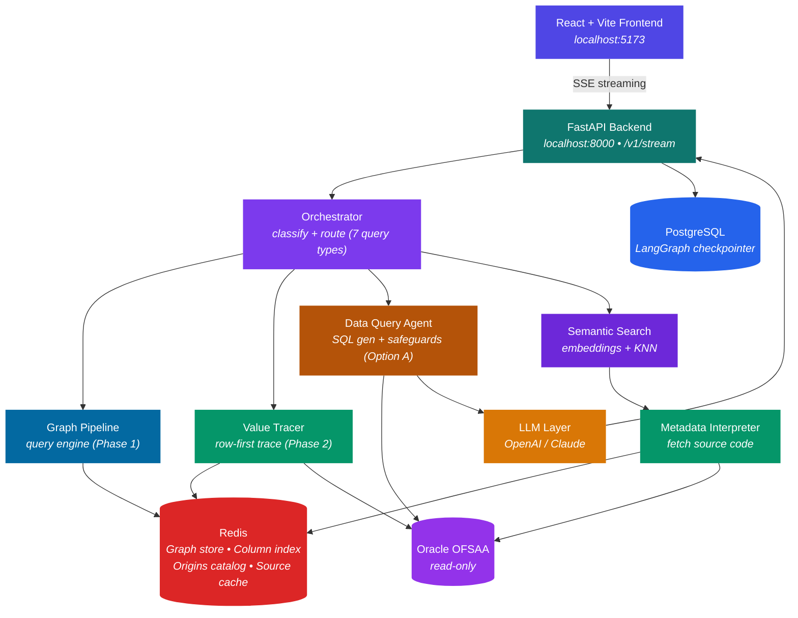
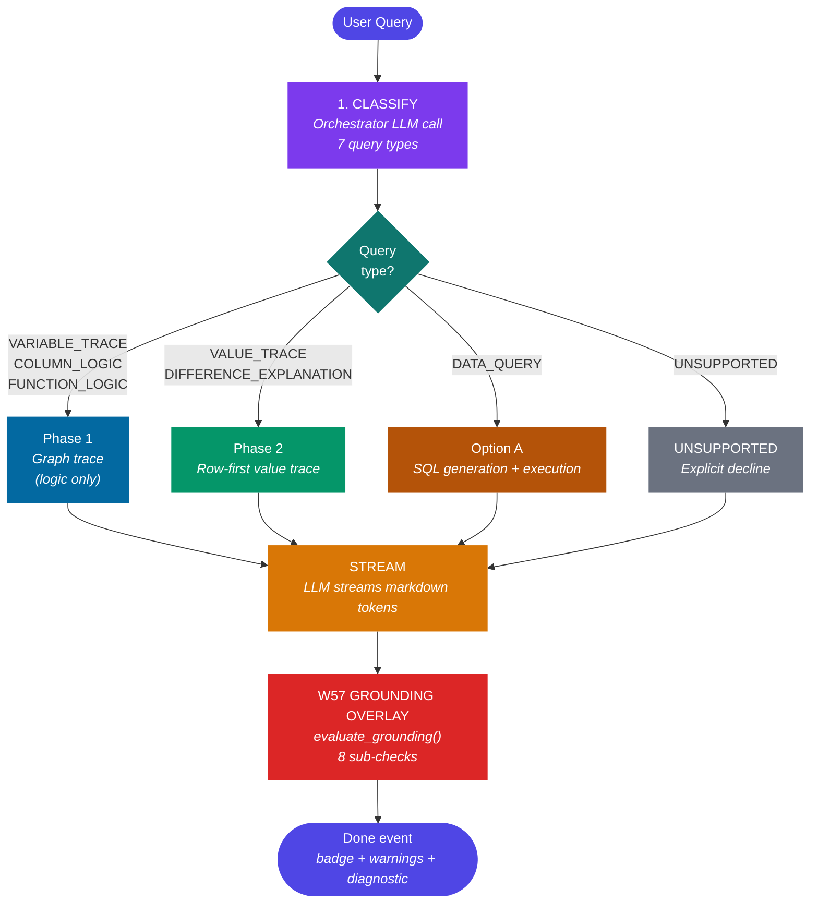
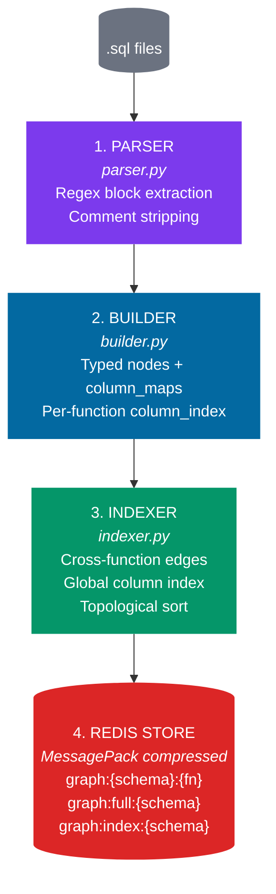
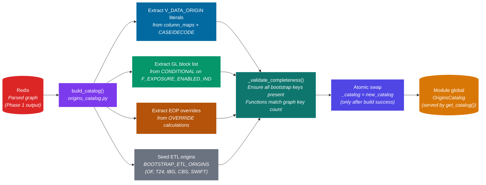
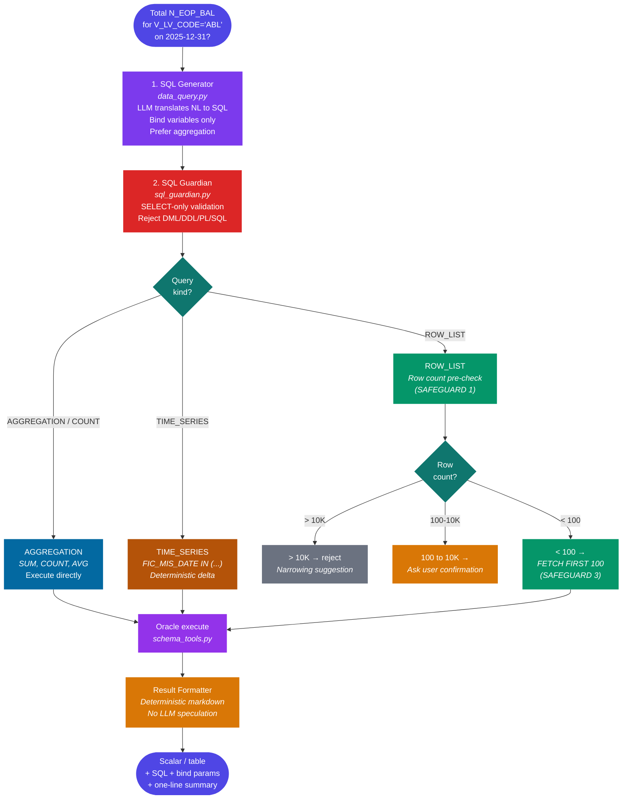
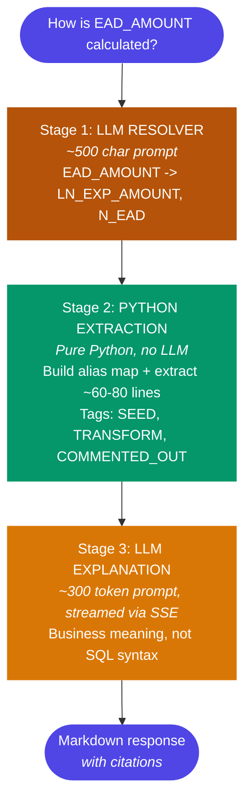

# RTIE — Regulatory Trace & Intelligence Engine

RTIE is a read-only multi-agent system that answers questions about an Oracle OFSAA FSAPPS deployment — explaining PL/SQL logic, tracing column lineage, classifying row origins (PL/SQL vs ETL), and executing validated SELECT-only SQL for aggregation questions. Built for Techlogix engineers working on Basel III/IV regulatory capital computations, it grounds every answer in parsed code or fetched data and declines explicitly when it can't.

This README is the onboarding entry point for a Techlogix engineer landing on RTIE for the first time. It assumes Python and Docker baseline familiarity and that Oracle access has been arranged. It does not cover provisioning OFSAA-shaped Oracle schemas or loading regulatory data — that is multi-day infrastructure work owned by the DBA team.

---

## What RTIE isn't

RTIE deliberately refuses several adjacent capabilities. These are scope choices, not backlog items:

| Out of scope | Why |
|---|---|
| Write operations of any kind | The Oracle service account is SELECT-only. `SqlGuardian` rejects DML/DDL at the application layer as a second defense. |
| Forecasting or prediction | RTIE is read-only introspection. "Which accounts will fail next quarter?" routes to UNSUPPORTED and declines. |
| Cross-table reconciliation against FCT / result tables | FCT lives in the OFSAA Results schema, which is outside RTIE's parsed graph scope. |
| References to tables not in `db/modules/*/functions/` | If a table isn't parsed into the graph, RTIE returns a capability-limitation response rather than guessing. |
| Speculation about upstream ETL systems | For rows with `V_DATA_ORIGIN = T24` / `OF` / `IBG` / `CBS`, RTIE states the origin and suggests where to investigate. It does not speculate about why the upstream value is what it is. |
| Proactive batch detection | RTIE is reactive — engineers ask, the system answers. No watchers, no alerts. |

A confidently wrong answer is worse than no answer. The architecture prioritizes refusal over guessing.

---

## Prerequisites

| Tool | Version | Notes |
|---|---|---|
| Python | 3.11+ (`pyproject.toml` declares `^3.11`) | 3.12 / 3.13 also fine |
| Poetry | 1.x or 2.x | Install via `pip install poetry`. There is no `requirements.txt`. |
| Docker Desktop (Windows) or Docker Engine (Linux) | Recent | Used for Redis Stack + PostgreSQL |
| Node.js + npm | LTS (20.x / 22.x) | For the React/Vite frontend |
| Oracle access | OFSAA FSAPPS with OFSMDM and OFSERM schemas | Read-only credentials. Provisioning is out of scope — assumed arranged by the DBA team. |
| OpenAI API key | — | Required: classification, embeddings, indexing, generation |
| Anthropic API key | — | Optional: frontend model selector can pick Claude |
| LangSmith API key | — | Optional: tracing/observability |

A standalone Windows-from-scratch walkthrough (Git install, WSL 2, Docker Desktop, every download link) lives at [docs/WINDOWS_SETUP.md](docs/WINDOWS_SETUP.md). The Windows quick start below assumes those prerequisites are already in place.

---

## Quick start — Linux / macOS

All commands run from inside the `RTIE/` directory (the repo root containing `pyproject.toml`, `run.py`, `docker-compose.yml`).

```bash
# 1. Install Python dependencies
poetry install
poetry shell                       # or prefix every command with `poetry run`

# 2. Create .env.dev from the template, fill in secrets
cp .env.example .env.dev
$EDITOR .env.dev                   # set ORACLE_*, OPENAI_API_KEY, etc.

# 3. Start Redis Stack + PostgreSQL
docker-compose up -d
docker ps                          # expect rtie-redis and rtie-postgres, both Up

# 4. Verify Redis (RediSearch is required for vector search)
docker exec -it rtie-redis redis-cli PING        # → PONG

# 5. Verify Postgres (used as the LangGraph checkpointer)
docker exec -it rtie-postgres pg_isready -U postgres   # → accepting connections

# 6. Place PL/SQL sources under db/modules/<MODULE>/functions/*.sql
#    (skip if a teammate has already populated db/modules/)

# 7. One-time index — parses sources, generates descriptions, builds vectors
python cli.py index --force

# 8. Start the backend (do NOT run `uvicorn src.main:app` directly — see below)
python run.py                      # listens on http://localhost:8000

# 9. Start the frontend in a second terminal
cd frontend
npm install
npm run dev                        # serves http://localhost:5173
```

Open [http://localhost:5173](http://localhost:5173) in the browser. The chat UI streams responses from `/v1/stream`.

**Why `python run.py` and not `uvicorn`.** [run.py](run.py) sets `WindowsSelectorEventLoopPolicy` on Windows before importing uvicorn. The psycopg async driver requires `SelectorEventLoop`; Windows' default `ProactorEventLoop` is incompatible. The launcher is a no-op on Linux but harmless to use everywhere.

---

## Quick start — Windows (PowerShell)

Same flow, with PowerShell-specific paths and environment-variable syntax. If you're starting from a clean Windows 11 machine, follow [docs/WINDOWS_SETUP.md](docs/WINDOWS_SETUP.md) first; the steps below assume Python, Docker Desktop, Node.js, and Git are already installed.

```powershell
# All commands run inside the RTIE folder.

# 1. Install dependencies
pip install poetry
poetry install
poetry shell

# 2. Create and edit .env.dev
Copy-Item .env.example .env.dev
notepad .env.dev

# 3. Start infrastructure (Docker Desktop must be running first)
docker compose up -d
docker ps                          # expect rtie-redis and rtie-postgres, both Up

# 4. Verify Redis
docker exec -it rtie-redis redis-cli PING        # → PONG

# 5. Verify Postgres
docker exec -it rtie-postgres pg_isready -U postgres

# 6. Index sources
python cli.py index --force

# 7. Start backend
python run.py

# 8. In a second PowerShell window — start frontend
cd frontend
npm install
npm run dev
```

**Restarting the backend on Windows — never blanket-kill Python.** `taskkill /F /IM python.exe` kills every Python process on the machine, including agent workers in other terminals. Find the specific PID and kill only it:

```powershell
netstat -ano | findstr :8000      # find the PID owning port 8000
taskkill /PID <pid> /F             # kill only that PID
python run.py                      # restart
```

---

## Verifying it works — the canary triple

Three queries exercise the three core capabilities. Run them from the UI (or via `python cli.py ask "…"`) after the backend is up. The expected outcomes below are the trust contract — if any one diverges, something in the setup or the index is wrong.

| # | Query | Expected outcome |
|---|---|---|
| 1 | `How does FN_LOAD_OPS_RISK_DATA work?` | **UNVERIFIED** badge. Body explains the function. Warnings array contains a `GROUNDING-HIGH:` entry catching either the "pass-through" template phrase or the line-198-369 padding fabrication. Route: `COLUMN_LOGIC`, schema `OFSMDM`. |
| 2 | `What is the total N_EOP_BAL for V_LV_CODE='ABL' on 2025-12-31?` | **VERIFIED** badge. `SUM(N_EOP_BAL) = -24,179,237,139.63` (exact). Route: `DATA_QUERY`, schema `OFSMDM`. SQL contains `V_LV_CODE` and `FIC_MIS_DATE`. |
| 3 | `How is CAP973 calculated?` | **UNVERIFIED** badge. Body anchors on `CS_REGULATORY_ADJUSTMENTS_PHASE_IN_DEDUCTION_AMOUNT`. Warnings array contains a `GROUNDING-HIGH:` entry from the W57 enforcer. |

The first and third are deliberate trust-contract tests: the body looks plausible but contains a fabrication that W57's grounding overlay catches and downgrades. The middle one is the deterministic data path — the SUM is exact, not approximate, and stamps the SQL into the response.

The formal canary suite lives at [tests/canary/canaries.yaml](tests/canary/canaries.yaml) (18 queries across 3 tiers); run it with:

```bash
python tests/canary/run_canaries.py --tier 1     # backend must be running on :8000
make canary-tier1                                # Makefile wrapper, same thing
```

---

## Architecture

### High-Level System Overview



### LLM Provider

All LLM calls use **OpenAI gpt-4o-mini** by default. Anthropic Claude is also supported — switch from the frontend model selector dropdown. Classification and embeddings use small payloads (<2KB); source analysis uses the graph pipeline payload (~2-4KB); SQL generation prompts are ~1-2KB.

### Query Types and Routing

The orchestrator ([src/agents/orchestrator.py](src/agents/orchestrator.py)) classifies every query into one of seven types and routes to the matching handler. This is the single decision that determines which capability answers the question.

| Query Type | Example | Handler | Phase |
|------------|---------|---------|-------|
| VARIABLE_TRACE | "How is EAD_AMOUNT calculated?" | Logic Explainer | 1 |
| COLUMN_LOGIC | "What does N_EOP_BAL do?" | Logic Explainer | 1 |
| FUNCTION_LOGIC | "Explain FN_LOAD_OPS_RISK_DATA" | Logic Explainer | 1 |
| VALUE_TRACE | "Why is N_EOP_BAL -10 for account X?" | Value Tracer | 2 |
| DIFFERENCE_EXPLANATION | "Bank says 52M, we show 50M for account X" | Value Tracer | 2 |
| DATA_QUERY | "Total N_EOP_BAL for V_LV_CODE='ABL'" | Data Query Agent | Option A |
| UNSUPPORTED | "FCT vs STG reconciliation" / forecasting | Capability decline | — |

**Ambiguity rule:** When unclear, the orchestrator defaults to VALUE_TRACE (which handles single-row questions correctly including breakdown requests). Mis-routing aggregation queries to VALUE_TRACE was the original silent-failure bug, so the classifier requires explicit aggregation keywords ("total", "sum", "count", "how many", "which accounts") AND absence of a specific account number to route to DATA_QUERY.

### Request Pipeline (SSE Streaming)

When a user asks a question, the `/v1/stream` endpoint processes it through stages, streaming Server-Sent Events (SSE) to the frontend at each stage:



The W57 grounding overlay runs after generation and only on `/v1/stream` — see the [Trust contract](#trust-contract--what-badges-mean) and [API endpoints](#api-endpoints--v1stream-vs-v1query) sections below.

### Phase 1 — Graph Pipeline (Startup + Query Time)

On application startup, the graph pipeline parses all `.sql` files into structured JSON graphs stored in Redis. A 1,500-line function (67,721 chars) compresses to ~288 lines (9,084 chars) — **86.6% reduction**. At query time, only the relevant subgraph is sent to the LLM (~300 tokens instead of ~17,000).



**Node types:** INSERT, UPDATE, MERGE, DELETE, SCALAR_COMPUTE, WHILE_LOOP, FOR_LOOP, SELECT_INTO

**Calculation types:** DIRECT, ARITHMETIC, CONDITIONAL, FALLBACK, OVERRIDE

**Parser handles these patterns:**

| Pattern | What it captures |
|---------|-----------------|
| Function-level execution conditions | `IF EXTRACT(MONTH...) = 12` — December-only functions |
| Intermediate variable calculations | `SELECT INTO` and `:=` assignments (SCALAR_COMPUTE nodes) |
| Composite key overrides | `DECODE(V_GL_CODE \|\| '-' \|\| V_BRANCH_CODE, ...)` |
| NVL/COALESCE fallback logic | Primary subquery lookup with column fallback |
| WHILE loop iteration detail | Counter range, what data each iteration processes |
| Transaction boundaries | `committed_after` flag on every node for failure analysis |
| Commented-out blocks | Flagged as `commented_out_nodes` — never treated as active logic |

**Schema awareness (W35 in flight).** `schema` is a first-class parameter throughout the loader, indexer, store, agents, and streaming layer. Redis keys are namespaced (`graph:OFSMDM:*`, `graph:OFSERM:*`). Phases 0-4 of the refactor have landed; Phases 5-8 (business-identifier indexing + routing) remain. See `docs/w35_architecture.md` and the `docs/w35_phaseN_summary.md` series before touching parsing, store, agents, or `main.py`.

### Query Engine (Query-Time Subgraph)

When a Phase 1 query arrives, the query engine resolves it to a compact structured payload in microseconds.


**Example: "How is N_ANNUAL_GROSS_INCOME calculated?"**

| Step | Tool | Time | Cost |
|---|---|---|---|
| Alias resolution | Redis | < 1ms | Free |
| Column index lookup | Redis | < 1ms | Free |
| Fetch 6 nodes + edges | Redis | < 1ms | Free |
| Assemble payload | Python | < 1ms | Free |
| LLM explanation | GPT-4o (1 call, ~500 tokens) | ~2s | ~$0.005 |

### Phase 2 — Value Lineage (Row-First Pipeline)

Phase 2 answers questions about actual data values: *"Why is this value X?"* It starts from the row, not the graph. The row's `V_DATA_ORIGIN` column reveals whether the value was computed by PL/SQL or loaded from external ETL — and that single fact determines the entire trace strategy.


**Row-first matters.** A row in STG_PRODUCT_PROCESSOR can arrive via at least four different paths:

1. PL/SQL function execution (traceable through the graph)
2. Direct ETL load from an external system (T24, IBG, CBS, ODF)
3. Manual upload processes
4. Other OFSAA modules outside the current batch

A graph-first trace assumes every row flows through PL/SQL and breaks when it doesn't. The row-first approach handles all four paths because classification comes from the row's `V_DATA_ORIGIN` column — not from assumptions about the pipeline shape.

### Origins Catalog (Auto-Derived from Graph)

The origins catalog maps `V_DATA_ORIGIN` values to what produced them, tracks GL codes in hardcoded block lists, and records hardcoded overrides (e.g. `N_EOP_BAL = 0` for specific GL codes). It is **built automatically at startup** by scanning the parsed graph in Redis. No hardcoded batch-specific knowledge.



**Hardened against partial initialization.** `build_catalog()` builds into a local variable first. The module global is only swapped in after `build()` succeeds AND `_validate_completeness()` passes. On any failure, the previous working catalog remains in memory (or stays `None` on first-time failure, causing clean `RuntimeError` on requests). No half-initialized catalog ever serves traffic.

**Adding a new batch:** Drop new `.sql` files under `db/modules/<NEW_MODULE>/functions/`, restart. The graph pipeline re-parses everything, the catalog rebuilds, new V_DATA_ORIGIN values and GL codes are picked up automatically. Zero code changes.

### Option A — Data Query Handler

Option A handles questions where the answer is in the database, not in the code. Aggregation, filter, count, time series — these are raw data questions that need SQL execution, not graph tracing.



**Three safeguards prevent large-dataset incidents:**

1. **Row count pre-check** — For row-list queries, run `COUNT(*)` first with the same WHERE clause. Hard limit of 10,000 rows rejects with a narrowing suggestion. Between 100-10,000 asks the user whether to return rows or a summary. Under 100 executes.

2. **Aggregation preference in the LLM prompt** — The SQL generator is explicitly instructed to produce SUM/COUNT/AVG queries when the question can be answered aggregately. "How many" becomes COUNT. "Total" becomes SUM.

3. **Mandatory row limit injection** — For row-listing queries that pass the count check, `FETCH FIRST 100 ROWS ONLY` is auto-appended after SQL generation, before execution.

**Time series presentation.** When a query provides `start_date` and `end_date`, the result table shows BOTH dates explicitly. Missing dates display `no data` placeholders — facts only, no speculation about why. When both dates have data and the target column is numeric, a deterministic delta is computed and displayed.

### Variable Tracer (Phase 1 Fallback)

When a logic query has no matches in the graph's column index, the Variable Tracer is the fallback. It extracts relevant lines from raw source using a hybrid LLM + Python approach.



**Primary path vs fallback:**
- **Graph pipeline** (primary) — used when the target variable is found in the column index. Produces a structured ~300 token payload. No raw source sent to LLM.
- **Variable Tracer** (fallback) — used when the graph has no matches. Extracts relevant lines from raw source using regex + LLM hybrid.

### Frontend Architecture

```
React + Vite + Tailwind CSS v4
    |
    +-- App.jsx              Main app with model selector
    +-- pages/Chat.jsx       Chat interface, auto-scroll control
    +-- components/
    |     MessageBubble.jsx  User messages (edit, retry, copy)
    |     |                  Assistant messages (streaming markdown)
    |     |                  AgentThinking (pipeline stage indicator)
    |     |                  CodeBlockWithCopy (syntax highlighted)
    |     ResponseCard.jsx   Structured response cards
    |     CommandResult.jsx  Slash command output
    +-- api/client.js        SSE streaming via fetch + ReadableStream
```

**SSE event flow:**
```
event: stage  -> Updates pipeline stage indicator (classify/trace/stream)
event: meta   -> Populates function list, origin info, SQL, bind params
event: token  -> Appends to streaming markdown (rendered incrementally)
event: done   -> Final metadata (badge, validated, warnings, source_citations,
                 functions_analyzed, meta, diagnostic — see Trust contract below)
event: error  -> Error display
```

---

## Trust contract — what badges mean

Every response carries a `badge` field in the `event: done` SSE payload. Three values:

**VERIFIED.** The response is grounded in the cited source. Citations resolve to lines in retrieved functions, the chain of cited functions is coherent with `functions_analyzed`, no template-phrase fabrications, no caveat triggers ("possible reasons", "might be because"). Trust the answer.

**UNVERIFIED.** The validator detected something off — a function name cited but not in retrieved sources, a line range not present in the cited function, an unsupported paraphrase template, a December-only execution claim that doesn't match the source, or a caveat trigger in the rendered text. The body of the response may still be largely correct, but the warnings array names what failed. Read the cited source before trusting.

**DECLINED.** RTIE refused to answer. Reasons include: function name not found in the graph (`function_not_found`), ungrounded identifier in an otherwise unanswerable query (W45), classifier routed to `UNSUPPORTED` (forecasting, cross-table reconciliation, unknown tables), or LLM error surfaced sanitized. The body explains why and (where useful) suggests rephrasing.

**Warning categories** (any one of these in `done.warnings` is meaningful):

| Prefix / tag | Severity | Meaning |
|---|---|---|
| `GROUNDING-HIGH:` | Blocks the badge → forces UNVERIFIED | W57 content-trust failure: fabricated function name, unsupported template phrase, December-claim mismatch, etc. |
| `GROUNDING-LOW:` | Advisory; badge stays VERIFIED | W57 citation hygiene: repeated citations, excessive line citations, padding patterns. |
| `UNGROUNDED_IDENTIFIERS` | Blocks the badge | User named an identifier (column / CAP-code / function) that doesn't appear in any indexed source. |
| `NAMED_FUNCTION_NOT_RETRIEVED` | Blocks the badge | User named a function whose source wasn't retrieved for this query. |
| `PARTIAL_SOURCE` | Blocks the badge | Function metadata is indexed but the source body isn't loaded (W49 path). |
| `CONTRADICTION` | Blocks the badge | Generated content contradicts a known fact (e.g. claimed function purpose vs. graph evidence). |

---

## API endpoints — `/v1/stream` vs `/v1/query`

**`/v1/stream` is the canonical endpoint.** It returns Server-Sent Events with `event: stage`, `event: meta`, `event: token`, and `event: done`. The `done` payload carries `badge`, `validated`, `warnings`, `explanation`, `meta`, `functions_analyzed`, `source_citations`, and (post-W84) a `diagnostic` block with W81/W70/W76 anchor state. This is what the frontend reads. This is what canary harnesses and benchmark drivers must read.

**`/v1/query` returns raw LangGraph state.** It produces `final_state["output"]` directly and **skips the W57 grounding overlay entirely** — no `badge`, no `warnings`, no validator output. It exists for debugging only. Do not probe `/v1/query` for trust signals; the body prose can look like a logic explanation even when the route is correct. Verify route from the `meta` / `done` fields on `/v1/stream` instead.

If you're writing a script that asserts on a response, use `/v1/stream` and parse the `done` SSE event.

---

## Schema scope (W79)

The frontend schema dropdown sends `schema_scope` to the backend with three values:

- **`ALL`** (default) — semantic search fans out across both OFSMDM and OFSERM; the result with the highest relevance wins. Use this when you don't know which schema a function lives in.
- **`OFSMDM`** — retrieval is constrained to `graph:OFSMDM:*`. Use this when you specifically want the staging/MDM layer.
- **`OFSERM`** — retrieval is constrained to `graph:OFSERM:*`. Use this for the regulatory/risk computation layer (CAP codes, capital structure functions).

Schema-aware behavior also threads through `DATA_QUERY` (table-name-to-schema pivot) and the column index (multi-schema column ownership). Single-owner columns pivot; multi-schema columns keep the orchestrator's classification.

---

## Common operations

```bash
# Backend
python run.py                                  # start (Windows-safe event loop)
netstat -ano | findstr :8000                   # find PID for restart (PowerShell)
taskkill /PID <pid> /F                         # kill only that PID — NEVER use /IM python.exe

# Indexing
python cli.py index --force                    # re-index everything after adding modules
python cli.py status                           # show indexed function counts per schema
python cli.py ask "How is N_EOP_BAL calculated?"

# Redis hygiene
docker exec -it rtie-redis redis-cli FLUSHDB   # wipe all keys (force full re-index after)
docker exec -it rtie-redis redis-cli DBSIZE    # current key count

# Tests
python -m pytest tests/unit/ -v                                # full unit suite
python -m pytest tests/unit/parsing/test_loader.py -v          # one file
python tests/canary/run_canaries.py --tier 1                   # Tier 1 canaries (backend must be up)
make canary-tier1                                              # Makefile wrapper

# Frontend
cd frontend && npm run dev                     # http://localhost:5173
cd frontend && npm run build
cd frontend && npm run lint
```

---

## Adding a new module

1. Drop `.sql` files under `db/modules/<NEW_MODULE>/functions/`. One function or procedure per file. Filename should match the function name (case-insensitive).
2. Re-index: `python cli.py index --force`.
3. Restart the backend: graph pipeline re-parses everything, origins catalog auto-rebuilds at startup, new `V_DATA_ORIGIN` literals and GL block-list codes get picked up.
4. Verify with `python cli.py status` — function count should reflect the new additions.

No code changes required to add a new module. The catalog system is hardened against partial initialization — if a rebuild fails, the previous catalog stays in memory; on first-time failure, requests get a clean `RuntimeError` rather than half-formed answers.

---

## Where to go next

- [CLAUDE.md](../CLAUDE.md) (one level above `RTIE/`) — agent guidance, project conventions, things-not-to-do, where-to-look-first map for common bug surfaces.
- [docs/](docs/) — W-ticket history. W35 is the active schema-aware refactor; W57 family is the trust contract; W76/W70/W78/W78a/W81/W83a are anchor/grounding work; W84 added diagnostic exposure in `/v1/stream`.
- [docs/WINDOWS_SETUP.md](docs/WINDOWS_SETUP.md) — clean-machine Windows walkthrough (Git, WSL 2, Docker Desktop, all download links).
- [docs/ARCHITECTURE_OVERVIEW.md](docs/ARCHITECTURE_OVERVIEW.md) — the deeper diagrams and pipeline shapes.
- [docs/RTIE_Weakness_Log.md](docs/RTIE_Weakness_Log.md) — known regressions, brittle paths, fix-vs-paper trade-offs.
- [tests/canary/canaries.yaml](tests/canary/canaries.yaml) — the full 18-query canary set with assertions and tier annotations.
- `scratch/` — captured benchmark runs (`v2_benchmark_run*.md`), one-off canary drivers (`w70_canary_*.py`), W-ticket experiments. Useful for "what did W57 actually change?" archaeology.

---

## Troubleshooting

**Backend fails to start with `RuntimeError: Cannot run the event loop ...`** — you ran `uvicorn src.main:app` directly. Always use `python run.py` on Windows. `run.py` sets the Selector event loop policy that psycopg requires.

**`.env.dev` missing.** It's gitignored. Copy from `.env.example` and fill in real values. Per the W35 worktree gotchas in `CLAUDE.md`, if you're using a parallel git worktree (`git worktree add ../RTIE-<branch>`), the `.env.dev` does NOT come with it — copy it across explicitly before `python run.py`.

**Oracle connection refused (`oracledb.exceptions.DatabaseError: DPY-6005`).** Check `ORACLE_HOST` / `ORACLE_PORT` / `ORACLE_SID` in `.env.dev`. On Windows test the network path with `Test-NetConnection -ComputerName <ORACLE_HOST> -Port 1521`. If `TcpTestSucceeded: False`, the issue is VPN or firewall, not RTIE.

**`ORA-00942: table or view does not exist` on canary queries.** The current `schema_scope` doesn't have access to the table. Either switch the dropdown to the right schema or set it to `ALL`. If the table genuinely doesn't exist in the deployment, the canary expectation needs adjusting; see `tests/canary/canaries.yaml` `needs_local_data` notes.

**Canary results don't match expected outcomes.** Most often this is a stale Redis index after a parser change or a partial re-index. Wipe and rebuild:

```bash
docker exec -it rtie-redis redis-cli FLUSHDB
python cli.py index --force
python run.py
```

**Redis container not running (`redis.exceptions.ConnectionError`).** Run `docker ps` — if `rtie-redis` isn't listed, `docker compose up -d` to bring it back. The Redis Stack image (not vanilla Redis) is required because RediSearch powers the vector index.

**Parallel-worktree friction.** Two specific gotchas, per `CLAUDE.md`: (1) `.env.dev` is gitignored, so a new worktree starts with no env file — copy it explicitly. (2) `sys.path` may pin to the original checkout's `src/`. In PowerShell, set `$env:PYTHONPATH = (Get-Location).Path + '\src'` before starting the worktree's backend. Verify the worktree's code is actually running by hitting a query and grepping the *worktree's* `logs/app.log` (not the original's) for a known signature line.

**`event: done` payload has no `badge` field.** You're reading `/v1/query`, not `/v1/stream`. `/v1/query` returns raw LangGraph state and skips the W57 overlay. Switch to `/v1/stream`.

---

## Environment variables

The loader is `load_dotenv(f".env.{ENVIRONMENT}")` in [src/main.py](src/main.py); `ENVIRONMENT=dev` (default) reads `.env.dev`. `cli.py` hardcodes `.env.dev`. Production deployments would set `ENVIRONMENT=prod` and provide `.env.prod`.

| Variable | Purpose | Default |
|---|---|---|
| `OPENAI_API_KEY` | OpenAI auth | (required) |
| `OPENAI_MODEL` | Default OpenAI model | `gpt-4o-mini` |
| `ANTHROPIC_API_KEY` | Anthropic auth | (optional) |
| `ANTHROPIC_MODEL` | Default Claude model | `claude-sonnet-4-20250514` |
| `DEFAULT_LLM_PROVIDER` | `openai` or `anthropic` | `openai` |
| `EMBEDDING_MODEL` | OpenAI embedding model | `text-embedding-3-small` |
| `ORACLE_HOST` / `ORACLE_PORT` / `ORACLE_SID` / `ORACLE_USER` / `ORACLE_PASSWORD` | Oracle connection (read-only) | — |
| `REDIS_HOST` / `REDIS_PORT` | Redis Stack | `localhost` / `6379` |
| `POSTGRES_HOST` / `POSTGRES_PORT` / `POSTGRES_DB` / `POSTGRES_USER` / `POSTGRES_PASSWORD` | LangGraph checkpointer | `localhost` / `5432` / `rtie` / `postgres` / (required) |
| `LANGSMITH_TRACING` / `LANGSMITH_API_KEY` / `LANGSMITH_PROJECT` / `LANGSMITH_ENDPOINT` | Optional tracing | tracing off if `LANGSMITH_TRACING != true` |
| `ENVIRONMENT` | Selects `.env.{ENVIRONMENT}` | `dev` |

The `docker-compose.yml` hardcodes `POSTGRES_PASSWORD=postgres123`; either match that in `.env.dev` or edit the compose file.
