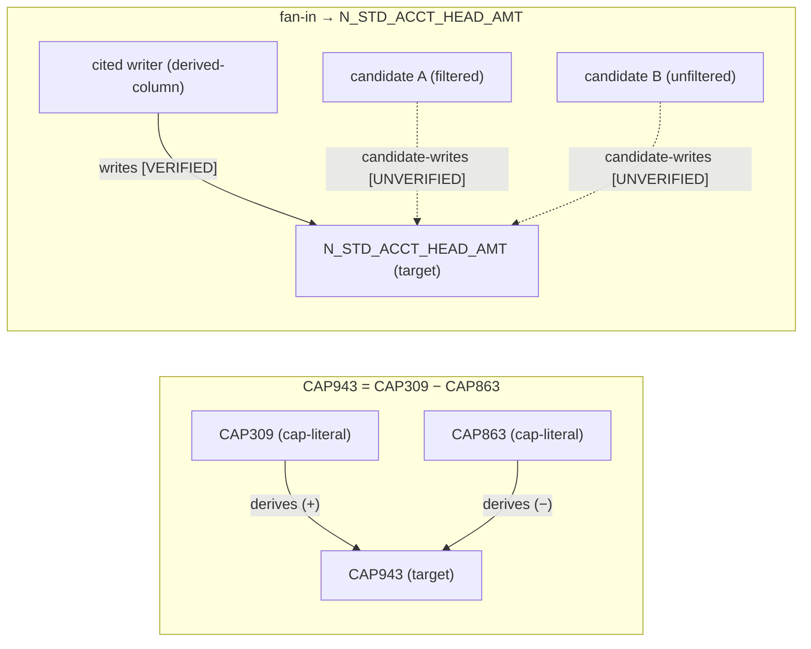

# Trace Diagram Grammar — Design Spec

> **Status:** DESIGN ONLY — no implementation, no backend wiring, no prototype
> changes. This document turns the Stage-2 frame into a grammar spec grounded in
> the real code, ready to drive a phased implementation later. **HOLD for
> review.**
>
> **W-number:** unassigned. The render prototype
> (`frontend/src/_proto_trace/`) is not currently tracked under a W-ticket; pick
> a number at implementation kickoff. Latest in `scratch/` is W150.
>
> **Scope reminder.** Trace-shaped query types only (VARIABLE_TRACE / Phase-2
> value trace / CAP-code derivation). Explicitly **out of scope:**
> FUNCTION_LOGIC / DATA_QUERY visuals; the ~2/10 rank-7 recall residual; any
> implementation or prototype edit.

---

## 0. What the prototype proved, and the one gap this spec closes

The prototype (`frontend/src/_proto_trace/CitedTraceDiagram.jsx`) settled the
rendering question: a **custom React + SVG** component with the trust contract
enforced **in code** — a solid edge is structurally impossible unless
`grounding === "VERIFIED"`, because the only path to a solid stroke runs through
`groundingGuard()`, which throws `GroundingViolation` otherwise
(`CitedTraceDiagram.jsx:37-50`, dispatch at `:114-127`). Mermaid was rejected
because declarative styling cannot enforce that guard.

The prototype's **one limit** is hand-placed pixel coordinates: every node
carries `pos: {x, y}` in the fixture (`fixture.json:12`, `:26`, …) and the edge
layer reads them directly (`rectOf` at `CitedTraceDiagram.jsx:57`). **That is
exactly what this grammar replaces** — the backend emits *topology* (nodes,
edges, groups, grounding), the client computes coordinates via auto-layout.

This spec keeps everything the prototype proved and removes only the hand-placed
geometry.

---

## 1. The Data Grammar (backend → frontend contract)

### 1.1 Design principle

The diagram is a **projection of structures the backend already builds**, not a
new analysis. Two existing producers already speak in node/edge vocabulary; the
grammar standardizes their output into one shape:

| Trace type | Existing producer | Existing shape |
|---|---|---|
| Column fan-in (`N_STD_ACCT_HEAD_AMT`) | `variable_tracer.trace_variable` → `state["variable_chain"]` | ordered transformation steps over tagged source lines (`variable_tracer.py:1259`, chain stored at `:1345-1354`) |
| Phase-2 value trace | `proof_builder.build_proof_chain` → `steps[]` | each step couples a graph node + an actual value (`proof_builder.py:22-103`) |
| CAP-code derivation DAG (`CAP943 = CAP309 - CAP863`) | `parsing/derivations.extract_derivations` | `{target_literal, target_column, source_literals, operation, operands, function, line_range}` (`derivations.py:668-817`) |

The grammar is the **lowest common denominator** of these three: a typed bag of
nodes + edges + groups, each element carrying its own grounding and its own
citation.

### 1.2 Node record

Extends the prototype's node (`fixture.json:7-19`). **Removes** `pos/w/h`
(client computes them). **Keeps** the trust-bearing fields verbatim.

```jsonc
{
  "id":     "string",          // stable within one diagram payload
  "label":  "string",          // display text; for column nodes the column name,
                               //   for CAP nodes the literal (e.g. "CAP943")
  "kind":   "target-column | derived-column | source-table | filter |
             absent-filter | cap-literal | operand | intermediate",
  "schema": "string",          // owning schema (OFSERM/OFSMDM/…); may be
                               //   "(not in retrieved source)" for a gap node
  "citation": {                // the W51 atom — see §4
    "function":  "string",     // resolved owning function/object
    "lines":     [start, end], // REAL source line numbers; [0,0] = no span
    "text":      "string",     // bounded excerpt (~50–80 line cap; §4)
    "grounding": "VERIFIED | UNVERIFIED"
  },
  "isDivergence": false        // optional; ringed in the alternatives frame
}
```

`kind` is the union of the prototype's kinds (`KIND_ICON` at
`CitedTraceDiagram.jsx:175-181`) plus `cap-literal` / `operand` / `intermediate`
for the DAG case. The renderer keys styling off `kind` + `citation.grounding`
(`Node` at `:183-226`); adding kinds is additive — unknown kinds fall back to
the `Database` icon (`:186`).

### 1.3 Edge record — an edge **is** a claim

An edge asserts "A flows into / derives B". That assertion can be wrong
independently of whether its endpoints are grounded, so **the edge carries its
own citation and its own grounding** (as in the prototype — see the edge fixtures
at `fixture.json:132-178`, each with both `grounding` and `citation.grounding`).

```jsonc
{
  "id":   "string",
  "from": "node-id",
  "to":   "node-id",
  "kind": "writes | reads | feeds | candidate-writes | derives | subtract-operand",
  "label": "string",           // OPTIONAL operand-sign annotation (W151) — "+"
                               //   minuend / "−" subtrahend for a SUBTRACT
                               //   derivation, "=" for DIRECT_ASSIGN. Cosmetic;
                               //   a dumb renderer may ignore it. Absent on
                               //   fan-in edges.
  "grounding":     "VERIFIED | UNVERIFIED",
  "ungroundedGap": false,      // true → dashed + "?" disc (prototype :148-154)
  "citation": { /* same atom shape as node.citation */ }
}
```

`kind` adds `derives` / `subtract-operand` for the CAP-code DAG; the existing
`writes/reads/feeds/candidate-writes` cover the fan-in case
(`fixture.json:136`, `:147`, `:157`, `:174`).

> **Ratified extension (W151 Phase 1).** The optional `label` field above is a
> grammar extension over the prototype's edge (which carried no label). It
> exists so the derivation DAG can show the operand's role in the arithmetic
> (`CAP943 = CAP309 [+] − CAP863 [−]`) without overloading `kind`. It carries no
> trust meaning — certainty comes only from `grounding`/`ungroundedGap` — so the
> renderer is free to ignore it. Implemented in
> `src/agents/trace_diagram.py` (`_assemble_derivation_dag`).

### 1.4 Group record (alternatives)

Unchanged from the prototype (`fixture.json:180-191`); drives the disjoint
"pick one" framing (`Frames` at `CitedTraceDiagram.jsx:245-269`).

> **Ratified semantics (W151 Phase 1).** The Phase-1 assembler treats groups as
> **pass-through**: it normalizes the shape and propagates `members` into the
> per-element grounding rule (any edge touching a group member is forced
> UNVERIFIED, §1.5 / Rule 2), but it does **not** itself *derive* alternative
> groups — no producer emits them yet. Group derivation is deferred and tied to
> the W150 near-twin path (see `docs/w151_trace_diagram_phase_plan.md`,
> deferred item B). For now the caller supplies `alternatives` explicitly.

```jsonc
{
  "kind": "alternative",
  "label": "string",
  "members": ["node-id", …],
  "candidates": [ { "label": "string", "nodes": ["node-id", …] }, … ],
  "divergence": { "between": ["node-id", "node-id"], "note": "string" }
}
```

### 1.5 The three element states

Per-element, **never** a single diagram badge (this is the core invariant):

| State | Source | Render (prototype enforces) |
|---|---|---|
| **cited** | `citation.grounding == "VERIFIED"` | solid edge (only via `groundingGuard`, `:47-50`); emerald node border (`:196`) |
| **alternative** | near-twin candidates, `UNVERIFIED` | disjoint sub-cards + `OR` divider + ringed divergence (`Frames :256-266`); dashed edges |
| **ungrounded-gap** | `edge.ungroundedGap == true` | dashed `2 7` stroke + burgundy `?` disc at midpoint (`:120`, `:148-154`) |

### 1.6 One vocabulary, both trace shapes

**Fan-in** (`N_STD_ACCT_HEAD_AMT`): writers are `derived-column` /
`source-table` / `filter` nodes; edges are `writes`/`reads`/`candidate-writes`
converging on a single `target-column`. This is the prototype fixture verbatim.

**CAP-code DAG** (`CAP943 = CAP309 - CAP863`): the derivation record
(`derivations.py:679-816`) maps directly:

```
target_literal  "CAP943"            → node {kind: cap-literal, id: "CAP943"}
source_literals ["CAP309","CAP863"] → nodes {kind: cap-literal}
operands        [{literal, …}, …]   → nodes {kind: operand}
operation       "SUBTRACT"          → two edges {kind: subtract-operand, derives}
                                        CAP309 → CAP943 (minuend)
                                        CAP863 → CAP943 (subtrahend, label "−")
function,line_range                 → citation.{function, lines}
```



Both shapes are the same `{nodes, edges, groups}` bag. The renderer needs no
shape-specific code — only `kind` + `grounding` dispatch, which it already does.

> **Flag — derivation grounding source.** `derivations.extract_derivations`
> emits a *structural* record (regex/AST over PL/SQL); it does not itself stamp
> `VERIFIED`. The grounding for CAP edges must be assigned by the same authority
> that grounds the prose (§2/§3): a derivation whose function body is in
> `multi_source` and confirmed → `VERIFIED`; otherwise `UNVERIFIED`. Do **not**
> let the parser's confidence double as grounding — they are different axes.

---

## 2. Auto-layout (the prototype's open gap)

### 2.1 Decision: **dagre**, client-side

- **Both shapes are layered DAGs.** Fan-in = many sources → one sink; CAP
  derivation = operands → target. Dagre's Sugiyama layered algorithm is the
  natural fit: rank by topological depth, order within rank to minimize
  crossings. ELK is more capable (orthogonal routing, port constraints) but is a
  heavier WASM/Java-port dependency; the two trace shapes never need ELK's extra
  power. **Choose dagre; revisit ELK only if a future trace shape needs
  orthogonal port routing.**
- **Layout is computed client-side from emitted topology.** The backend MUST NOT
  hand-place coordinates — it emits nodes/edges only. This is the explicit fix
  for the prototype's hand-placed `pos` (`fixture.json:12` etc.).
- **The alternatives frame stays a manual overlay.** Dagre lays out nodes within
  each candidate subgraph; the disjoint "pick one" framing + `OR` divider +
  divergence ring is drawn around the computed bounding boxes (the prototype's
  `Frames` logic at `CitedTraceDiagram.jsx:245-269`, re-parameterized to read
  dagre rects instead of literals). Disjointness is a **group** property (§1.4),
  not a layout property.
- **Edges keep the existing SVG bezier renderer** (`anchorPair`/`bezier` at
  `CitedTraceDiagram.jsx:59-81`); only the node rectangles' `{x,y,w,h}` now come
  from dagre instead of the fixture. The `groundingGuard` dispatch (`:114-127`)
  is untouched — **layout never touches grounding.**

> **Flag — new dependency.** `frontend/package.json` currently has **no** layout
> library (deps listed at `package.json:12-21`). Dagre (`@dagrejs/dagre`) is a
> net-new runtime dependency. The prototype computed nothing — it read pixels —
> so this is genuinely new surface, not a swap.

### 2.2 Contract

```
backend  → { nodes:[{id,kind,label,citation,…}], edges:[{from,to,kind,…}], groups:[…] }
client   → dagre.layout(graph) → assigns {x,y,w,h} per node
renderer → draws nodes at computed rects; edges via existing bezier; grounding
           dispatch unchanged
```

---

## 3. Emission (separate SSE event)

### 3.1 Where it slots in `/v1/stream`

The stream is a raw-`yield` SSE generator in `src/main.py` (`event_stream`
inside the `/v1/stream` handler). Event framing is literal f-strings:
`event: stage` / `event: meta` (`main.py:1416`) / `event: token` (many) /
`event: done` (`main.py:1908`) / `event: error` (`main.py:1926`). The whole
generator is wrapped in `StreamingResponse(..., media_type="text/event-stream")`
(`main.py:1933-1935`).

The grounding verdict is computed into the local `grounding` dict
(`evaluate_grounding`, consumed around `main.py:1805-1844`) and the `done`
payload is assembled at `main.py:1870-1906`. **`event: diagram` is emitted in
the narrow window after grounding is finalized and before `done`** — i.e.
between the caveat-stream block (`main.py:1846-1869`) and the `done` yield
(`main.py:1908`):

```python
# AFTER grounding["badge"] is final, BEFORE the done payload yield (~main.py:1907):
diagram = build_trace_diagram(state, grounding)      # NEW; grounds every element
if diagram is not None:                              # None on DECLINED / non-trace
    yield f"event: diagram\ndata: {json_mod.dumps(diagram)}\n\n"
```

`build_trace_diagram` is the new assembler: it reads `state["variable_chain"]` /
the proof chain / the derivation records, and stamps each element's `grounding`
from the **same** `grounding` verdict that governs the body. It returns `None`
when the badge is `DECLINED` (see §3.3) or the query is not trace-shaped.

### 3.2 Payload shape

```jsonc
// event: diagram
{
  "correlation_id": "string",
  "target": "N_STD_ACCT_HEAD_AMT | CAP943 | …",
  "trace_kind": "fan-in | derivation-dag",
  "diagram_grounding": "VERIFIED | UNVERIFIED",  // = grounding["badge"]; the
                                                  //   aggregate the done event
                                                  //   re-asserts (§3.3)
  "nodes":  [ /* §1.2 */ ],
  "edges":  [ /* §1.3 */ ],
  "groups": [ /* §1.4 */ ]
}
```

`diagram_grounding` is the **diagram-level** aggregate (it equals
`grounding["badge"]`). It exists **only** so the `done` event can assert
equality (§3.3). It is **not** a per-element badge and the renderer must not use
it to upgrade any element — per-element `citation.grounding` is authoritative
(invariant §5).

### 3.3 `done` asserts diagram-grounding == body-grounding; suppression

The `done` payload (`main.py:1870-1906`) carries `badge` (`:1873`) and
`validated` (`:1872`). To let the frontend detect divergence, add **one field**
to `done`:

```jsonc
// added to done_payload (~main.py:1905, beside "diagnostic")
"diagram_emitted": true,                  // whether an event: diagram was sent
"diagram_grounding": grounding["badge"]   // the value the diagram claimed
```

**Frontend rule:** the diagram renders **iff**
`diagram_emitted && diagram_grounding === done.badge`. On any divergence — or if
`done.badge == "DECLINED"`, or no `diagram` event arrived — the frontend
**suppresses** the diagram entirely.

**Why this is safe (clean degradation):** the **prose is authoritative**
(invariant §5). The diagram is a navigation aid layered *on top of* a complete
streamed answer — the `token` events (`main.py:1650`, `:1682`, …) and the
`done.explanation.markdown` (`main.py:1896-1899`) already constitute the full
answer. Suppressing the diagram removes only the aid; the prose remains
complete. A suppressed diagram leaves **no hole** — it degrades to exactly the
answer the user would have gotten before this feature existed. The renderer
shows nothing where the diagram would have been (not an error, not a
placeholder), because the authoritative answer is already on screen.

> **Flag — DECLINED is not a badge, it is a different response shape.** The
> Stage-2 frame's invariant "DECLINED → NO diagram" maps cleanly, but note the
> code reality: `evaluate_grounding` only ever returns `badge ∈ {VERIFIED,
> UNVERIFIED}` (`logic_explainer.py:201`, `:336/:343/:346`). `DECLINED` comes
> from a **separate** path — `build_declined_response` (`llm_errors.py:227-251`,
> `"badge": "DECLINED"`, `"type": "llm_api_error"`), emitted on the exception
> branch (`main.py:1915-1920`). On that branch the generator never reaches the
> diagram-emit point, so **no `diagram` event is ever produced for a DECLINED
> response** — suppression for DECLINED is automatic and structural, not a
> frontend check. The frontend check (`diagram_emitted` false) is the
> belt-and-braces backstop.

### 3.4 Frontend consumer wiring

`client.js streamQuery` dispatches on `currentEvent` (`client.js:107-137`) with
a callbacks bag (`:58`). Adding the event is additive:

```js
// client.js ~:119, new branch beside meta/token/done
} else if (currentEvent === 'diagram') {
  onDiagram?.(parsed);
```

`App.jsx` already merges `meta` into the answer record after `done`
(referenced at `main.py:1879-1885`, "App.jsx:135-141"). The diagram payload
attaches to the same answer record; `MessageBubble.jsx` / `Answer.jsx` decide
whether to render it using the §3.3 equality rule. The prototype component
(`CitedTraceDiagram.jsx`) is the renderer, fed `{nodes,edges,groups}` from the
event instead of `fixture.json`, with dagre supplying `{x,y,w,h}`.

---

## 4. Citation / source — citation + span as ONE atom (closes W51)

### 4.1 The W51 drift, in code

> **Flag — W51 is a design-conversation reference, not a code symbol.** Grep
> finds no `W51` anywhere in the repo. But the drift it names is real and
> visible: today **citations and source spans come from two different places.**

- **Source span** is resolved by `MetadataInterpreter.fetch_multi_logic`
  (`metadata_interpreter.py:390-491`), which returns
  `multi_source[fn] = {source_code: [{"line": N, "text": …}], schema,
  description, …}` (`:459-466`). The line numbers are real (loader cache / Oracle
  `ALL_SOURCE` / disk, all numbered — `:80`, `:118`, `:352`). This is **the**
  single source resolver (CLAUDE.md: "Don't bypass `metadata_interpreter` for
  source code").
- **Citations**, by contrast, are **regex-scraped from the rendered markdown**
  *after generation* — `_extract_line_citations(markdown)` at
  `logic_explainer.py:209`, returned as `source_citations` in the grounding dict
  (`:364`) and onto `done` (`main.py:1874`).

These two can drift: the LLM can write `[lines 40-58]` in prose that does not
correspond to what `fetch_multi_logic` actually resolved. That divergence is the
W51 failure class.

### 4.2 The fix: one resolve yields citation + span together

The diagram's citation atom (§1.2 `citation`) is produced **from the
`multi_source` resolve, not from the markdown.** For each node/edge the
assembler (`build_trace_diagram`, §3.1) reads:

```
function  ← the function key in multi_source
schema    ← multi_source[fn]["schema"]              (metadata_interpreter.py:461)
lines     ← [first, last] of the relevant slice of
            multi_source[fn]["source_code"]          (real line numbers)
text      ← the joined text of exactly that slice    (bounded — see §4.3)
grounding ← the §3 verdict for that element
```

Because both the line numbers *and* the excerpt text are sliced from the **same
resolved `source_code` list**, they cannot disagree: the span IS the citation.
The LLM is never the source of the citation — it never sees the whole body and
cannot invent a line range, which makes W51 reproduction **structurally
impossible** for diagram elements.

### 4.3 Bounded spans + lazy overflow endpoint

- Embed at most **~50–80 source lines** per citation `text` (the same budget the
  variable tracer already targets for its compact chain — "~60-80 lines",
  `variable_tracer.py:13`, `:442`). Cap is per-element.
- **Overflow** (a span larger than the cap, or a "show full function" request)
  is served by a **new lazy endpoint**:

  ```
  GET /v1/source?schema=<S>&function=<F>&start=<n>&end=<m>
  ```

  > **Flag — `/v1/source` does not exist yet.** Grep finds no such route in
  > `src/main.py`. It is net-new. It MUST resolve through `MetadataInterpreter`
  > (CLAUDE.md hard rule) — i.e. call the same `fetch_logic` /
  > `get_raw_source` path (`metadata_interpreter.py:301-388`,
  > `:191-212`), returning only the requested `[start,end]` slice of real
  > numbered lines. It must NOT introduce a second source-resolution path.

- **Only cited ranges are ever emitted.** The diagram payload carries bounded
  excerpts; the full body is never serialized into the event and never handed to
  the LLM. The grammar therefore only ever exposes ranges the resolver actually
  produced.

---

## 5. Trust invariants (carried verbatim — these govern the grammar)

1. **A diagram never shows more certainty than its elements' grounding.**
   Enforced structurally: solid stroke only via `groundingGuard`
   (`CitedTraceDiagram.jsx:47-50`); no element reads the diagram-level
   `diagram_grounding` to upgrade itself (§3.2).
2. **VERIFIED → solid; UNVERIFIED → parallel-alternatives or dashed-gap;
   DECLINED → NO diagram.** (DECLINED is structurally never emitted — §3.3 flag.)
3. **The renderer is dumb: it draws what grounding says, never infers
   grounding.** The renderer takes `grounding` as data and dispatches; it
   computes geometry (dagre) but never certainty.
4. **Near-twin alternatives = disjoint subgraphs ("pick one"), divergence point
   highlighted; twin descriptions come from `rtie:vec`, NEVER generated.** The
   group's candidate labels/descriptions are sourced from the vector store
   retrieval results, not LLM prose.
5. **The diagram is a navigation aid; PROSE is authoritative. Disagreement is a
   bug** — and §3.3's `done`-equality assertion is the mechanism that catches it
   and suppresses rather than ships a contradiction.

---

## 6. Real code touchpoints (index)

| Concern | File:line |
|---|---|
| Prototype renderer + in-code trust guard | `frontend/src/_proto_trace/CitedTraceDiagram.jsx:37-50` (guard), `:114-127` (dispatch), `:245-269` (alternatives frame) |
| Prototype node/edge fixture (shape to extend) | `frontend/src/_proto_trace/fixture.json` |
| SSE generator + event framing | `src/main.py` `/v1/stream`: `event: meta` `:1416`, `token` `:1650`, `done` `:1908`, `error` `:1926` |
| `done` payload (badge/validated/citations) | `src/main.py:1870-1906` |
| Diagram-emit window | `src/main.py:1869` (after caveats) → `:1907` (before done) |
| `StreamingResponse` content type | `src/main.py:1933-1935` |
| Grounding verdict (binary badge) | `src/agents/logic_explainer.py:176-367`; badge values `:336/:343/:346` |
| Citations regex-scraped from markdown (W51 root) | `src/agents/logic_explainer.py:209`, surfaced `:364` |
| W57 enforcement | `src/agents/logic_explainer.py:308` (`w57_enforce_grounding`) |
| DECLINED — separate response shape | `src/llm_errors.py:227-251`; emitted `src/main.py:1915-1920` |
| Single source resolver (citation+span atom) | `src/agents/metadata_interpreter.py:390-491` (`fetch_multi_logic`), numbered lines `:80/:118/:352` |
| Lazy source path to reuse for `/v1/source` | `src/agents/metadata_interpreter.py:301-388`, `:191-212` |
| Fan-in trace producer | `src/agents/variable_tracer.py:1259` (`trace_variable`), chain `:1345-1354`, builder `:782` |
| Phase-2 proof chain producer | `src/phase2/proof_builder.py:22-103` (`build_proof_chain`, `steps[]`) |
| CAP-code derivation record (DAG) | `src/parsing/derivations.py:668-817`; record shape `:679-816`; ops `:324/:332` |
| Frontend SSE dispatch | `frontend/src/api/client.js:107-137`; callbacks `:58` |
| Frontend deps (no layout lib today) | `frontend/package.json:12-21` |
| LangGraph state (where diagram would read from) | `src/pipeline/state.py` (`variable_chain` `:60`, `multi_source` `:57`, `bi_routing` `:77`) |

---

## 7. Open questions flagged for review (design ↔ code frictions, not resolved)

1. **Element-grounding for parser-derived CAP edges.** `extract_derivations`
   produces structure, not grounding (§1.6 flag). The assembler must stamp each
   CAP edge's `grounding` from the §3 body verdict — decide the exact rule
   (function-in-`multi_source` ⇒ VERIFIED?) at implementation, and confirm it
   matches how the prose grounds the same derivation.
2. **Per-element vs. whole-diagram grounding granularity.** Today the badge is a
   single whole-response verdict (`evaluate_grounding` returns one `badge`). The
   grammar wants *per-element* grounding. The assembler will need a per-element
   grounding signal, which the current binary badge does not provide directly.
   Decide: derive per-element grounding from `multi_source` membership +
   per-element citation presence, or extend the grounding evaluator to return a
   per-citation map. **This is the largest design-vs-code gap.**
3. **`diagram_grounding` aggregate definition.** §3.3 equates it to
   `grounding["badge"]`. If per-element grounding (Q2) is introduced, define the
   aggregate as `all elements VERIFIED ⇒ VERIFIED else UNVERIFIED`, and re-check
   that the `done`-equality assertion still holds.
4. **`rtie:vec` twin-description sourcing.** Invariant §5.4 requires alternative
   descriptions to come from `rtie:vec`, never generated. Confirm the retrieval
   results carried in `state["search_results"]` / `multi_source[*]["description"]`
   (`metadata_interpreter.py:462`) are the verbatim vector-store descriptions and
   not LLM-rewritten before they reach the assembler.
5. **W-number + doc placement.** Assign a W-ticket at kickoff and rename this
   doc to `docs/wNNN_*.md` per convention.

---

*End of spec. No code written, no branch created, no commit made. HOLD for
review.*
